# Ansible

Ansible is a suite of software tools that enables infrastructure as code. It is open-source and the suite includes software provisioning, configuration management, and application deployment functionality

Ansible is agentless

## Ansible Inventory

/etc/ansible/hosts

Invenotory parameters
- ansible_connection -ssh/winrm/localhost ssh para linux winrm para windows
- ansible_port - 22/5986
- ansible_user - root/administrator
- ansible_ssh_pass - Password

        # Sample Inventory File

        # Web Servers
        web1 ansible_host=server1.company.com ansible_connection=ssh ansible_user=root ansible_ssh_pass=Password123!
        web2 ansible_host=server2.company.com ansible_connection=ssh ansible_user=root ansible_ssh_pass=Password123!
        web3 ansible_host=server3.company.com ansible_connection=ssh ansible_user=root ansible_ssh_pass=Password123!

        # Database Servers
        db1 ansible_host=server4.company.com ansible_connection=winrm ansible_user=administrator ansible_password=Password123!


```
# Sample Inventory File

# Web Servers
web1 ansible_host=server1.company.com ansible_connection=ssh ansible_user=root ansible_ssh_pass=Password123!
web2 ansible_host=server2.company.com ansible_connection=ssh ansible_user=root ansible_ssh_pass=Password123!
web3 ansible_host=server3.company.com ansible_connection=ssh ansible_user=root ansible_ssh_pass=Password123!

# Database Servers
db1 ansible_host=server4.company.com ansible_connection=winrm ansible_user=administrator ansible_password=Password123!


[web_servers]
web1
web2
web3

[db_servers]
db1

[all_servers:children]
web_servers
db_servers

```

## Playbooks

Ansible Playbooks offer a repeatable, re-usable, simple configuration management and multi-machine deployment system, one that is well suited to deploying complex applications. If you need to execute a task with Ansible more than once, write a playbook and put it under source control. Then you can use the playbook to push out new configuration or confirm the configuration of remote systems.

Play defines a set of activities (tasks (an action to be performed on the host like execute command, run a script, install package, etc)) to be run on hosts

- plays have name, hosts and tasks
- properties of dictionary the order doesn't matter
- a list or array is an order collection and order matter


ansible-playbook <NAMEPLAYBOOK.yaml> -i inventory.txt

## Ansible Modules

- System
- Commands: execute commands
- Script: execute scripts
- files: work with files
- Database: work with database mongo, postgresql
- cloud:  aws., azurw, docker
- windows ansible in windows environment

```
-
    name: 'Stop the web services on web server nodes'
    hosts: web_nodes
    tasks:
        -
            name: 'Stop the web services on web server nodes'
            command: 'service httpd stop'
-
    name: 'Shutdown the database services on db server nodes'
    hosts: db_nodes
    tasks:
        -
            name: 'Shutdown the database services on db server nodes'
            command: 'service mysql stop'
-
    name: 'Restart all servers (web and db) at once'
    hosts: all_nodes
    tasks:
        -
            name: 'Restart all servers (web and db) at once'
            command: '/sbin/shutdown -r'
-
    name: 'Start the database services on db server nodes'
    hosts: db_nodes
    tasks:
        -
            name: 'Start the database services on db server nodes'
            command: 'service mysql start'
-
    name: 'Start the web services on web server nodes'
    hosts: web_nodes
    tasks:
        -
            name: 'Start the web services on web server nodes'
            command: 'service httpd start'


```

```
-
    name: 'Execute a script on all web server nodes'
    hosts: web_nodes
    tasks:
        -
            name: 'Execute a script on all web server nodes'
            script: /tmp/install_script.sh
        -
            name:  'Start httpd service'
            service: 'name=httpd state=started'


```

```
-
    name: 'Execute a script on all web server nodes and start httpd service'
    hosts: web_nodes
    tasks:
        -
            name: 'Update entry into /etc/resolv.conf'
            lineinfile:
                path: /etc/resolv.conf
                line: 'nameserver 10.1.250.10'
        - 
            user:
                uid: 1040
                group: developers
        -
            name: 'Execute a script'
            script: /tmp/install_script.sh
        -
            name: 'Start httpd service'
            service:
                name: httpd
                state: present


```

## Ansible Variables

- Stores information that varies with each host
```
-
    name: 'Update nameserver entry into resolv.conf file on localhost'
    hosts: localhost
    tasks:
        -
            name: 'Update nameserver entry into resolv.conf file'
            lineinfile:
                path: /etc/resolv.conf
                line: 'nameserver {{nameserver_ip}}'
```

```
-
    name: 'Update nameserver entry into resolv.conf file on localhost'
    hosts: localhost
    vars:
        car_model: 'BMWM3'
        country_name: 'USA'
        title: 'SystemsEngineer'
    tasks:
        -
            name: 'Print my car model'
            command: 'echo "My car''s model is {{car_model}}"'
        -
            name: 'Print my country'
            command: 'echo "I live in the {{country_name}}"'
        -
            name: 'Print my title'
            command: 'echo "I work as a {{title}}"'
```


## Conditionals

```
-
    name: 'Execute a script on all web server nodes'
    hosts: all_servers
    tasks:
        -
            service: 'name=mysql state=started'
            when: ansible_host =='server4.company.com'
```

```
-
    name: 'Am I an Adult or a Child?'
    hosts: localhost
    vars:
        age: 25
    tasks:
        -
            command: 'echo "I am a Child"'
            when: age<18
        -
            command: 'echo "I am an Adult"'
            when: age >= 18
```
```
-
    name: 'Add name server entry if not already entered'
    hosts: localhost
    tasks:
        -
            shell: 'cat /etc/resolv.conf'
            register: command_output
        -
            shell: 'echo "nameserver 10.0.250.10" >> /etc/resolv.conf'
            when: 'command_output.stdout.find("10.0.250.10") == -1'


```

## Loops

Ansible offers the **loop**, **with_\<lookup\>**, and **until** keywords to execute a task multiple times. Examples of commonly-used loops include changing ownership on several files and/or directories with the file module, creating multiple users with the user module, and repeating a polling step until a certain result is reached.
```
-
    name: 'Print list of fruits'
    hosts: localhost
    vars:
        fruits:
            - Apple
            - Banana
            - Grapes
            - Orange
    tasks:
        -
            command: 'echo "{{ item }}"'
            with_items: '{{ fruits }}'

```
```
-
    name: 'Install required packages'
    hosts: localhost
    vars:
        packages:
            - httpd
            - binutils
            - glibc
            - ksh
            - libaio
            - libXext
            - gcc
            - make
            - sysstat
            - unixODBC
            - mongodb
            - nodejs
            - grunt
    tasks:
        -
            yum: 'name={{ item }} state=present'
            with_items: "{{ packages}}"

```

## Ansible Roles

Roles let you automatically load related vars, files, tasks, handlers, and other Ansible artifacts based on a known file structure. After you group your content in roles, you can easily reuse them and share them with other users.

etc/ansible/roles is default location ansible search for roles

## Preparing windows

- Ansible control machine can only be a linux and not windows
- Windows machines can be targets of ansible and thus be part of automation
- Ansible connects to a windows machine using winrm
- Requirements
    - pywinrm module installed on the ansible control machine- pip install "pywinrm>=0.2.2"
    - setup WinRM- examples/scripts/configureRemotingFor Ansible.ps1
    - Diffetent modes of authentication:
        - Basic/Certificate/Kerberos/NTML/CredSSP

## Ansible Galaxy

Ansible Galaxy is essentially a large public repository of Ansible roles. Roles ship with READMEs detailing the role's use and available variables. Galaxy contains a large number of roles that are constantly evolving and increasing. Galaxy can use git to add other role sources, such as GitHub.

https://galaxy.ansible.com/ 

## Patterns

When you execute Ansible through an ad hoc command or by running a playbook, you must choose which managed nodes or groups you want to execute against. Patterns let you run commands and playbooks against specific hosts and/or groups in your inventory. An Ansible pattern can refer to a single host, an IP address, an inventory group, a set of groups, or all hosts in your inventory. Patterns are highly flexible - you can exclude or require subsets of hosts, use wildcards or regular expressions, and more. Ansible executes on all inventory hosts included in the pattern.

### Common patterns
This table lists common patterns for targeting inventory hosts and groups.

Description|Pattern(s)|Targets
|-|-|-|
All hosts|all (or *)|
One host	|host1
Multiple hosts	|host1:host2 (or host1,host2)
One group	|webservers
Multiple groups	|webservers:dbservers|all hosts in webservers plus all hosts in dbservers
Excluding groups	|webservers:!atlanta|all hosts in webservers except those in atlanta
Intersection of groups	|webservers:&staging|any hosts in webservers that are also in staging

You can use either a comma (,) or a colon (:) to separate a list of hosts. The comma is preferred when dealing with ranges and IPv6 addresses.

## Dynamic inventory

If your Ansible inventory fluctuates over time, with hosts spinning up and shutting down in response to business demands, the static inventory solutions described in How to build your inventory will not serve your needs. You may need to track hosts from multiple sources: cloud providers, LDAP, Cobbler, and/or enterprise CMDB systems.

Ansible integrates all of these options through a dynamic external inventory system. Ansible supports two ways to connect with external inventory: Inventory plugins and inventory scripts.

Inventory plugins take advantage of the most recent updates to the Ansible core code. We recommend plugins over scripts for dynamic inventory. You can write your own plugin to connect to additional dynamic inventory sources.

You can still use inventory scripts if you choose. When we implemented inventory plugins, we ensured backwards compatibility through the script inventory plugin. The examples below illustrate how to use inventory scripts.

If you prefer a GUI for handling dynamic inventory, the inventory database on AWX or Red Hat Ansible Automation Platform syncs with all your dynamic inventory sources, provides web and REST access to the results, and offers a graphical inventory editor. With a database record of all of your hosts, you can correlate past event history and see which hosts have had failures on their last playbook runs

## Custom modules

A module is a reusable, standalone script that Ansible runs on your behalf, either locally or remotely. Modules interact with your local machine, an API, or a remote system to perform specific tasks like changing a database password or spinning up a cloud instance. Each module can be used by the Ansible API, or by the ansible or ansible-playbook programs. A module provides a defined interface, accepts arguments, and returns information to Ansible by printing a JSON string to stdout before exiting.

https://docs.ansible.com/ansible/latest/dev_guide/developing_modules_general.html


_____

https://www.interviewbit.com/ansible-interview-questions/
__________

# Ansible advanced


# Ansible desde Cero

## Configurar SSH usuario root

- primero generar un ssh key
    ```
    ssh-keygen
    ```
se genera una clave privada y una publica se comparte la .pub con los servidores a administrar

para copiar la clave publica a los servidores administrados

- crear directorio .ssh
```
 mkdir .ssh
```

- copiar la clave publica al servidor administrado

```
ssh-copy-id <serveradministrado>
```
aceptar fingerprint y luego dar el password del server administrado

y se copia la clave publica en la carpeta authorized_keys dentro de la carpeta .ssh

## Cofigurar usuario ansible

crear usuario ansible en el server administrado

```
- useradd ansible crear usuario ansible
- passwd ansible darle una password al usuario ansible
```

en /home/ansible aca debe estar la clave publica dle usuario ansible desde el servidor controlador

crear usuario ansible en el server controlador

```
- useradd ansible crear usuario ansible
- passwd ansible darle una password al usuario ansible
```

primero generar un ssh key
    ```
    ssh-keygen
    ```
se genera una clave privada y una publica se comparte la .pub con los servidores a administrar

opiar la clave publica al servidor administrado

```
ssh-copy-id <serveradministrado>
```

aceptar fingerprint y luego dar el password del server administrado

y se copia la clave publica en la carpeta authorized_keys dentro de la carpeta .ssh

## Dar permisos a usuario para hacer SUDO

con usuario root ingresar a /etc y editar el file sudoers en el server admnistrado

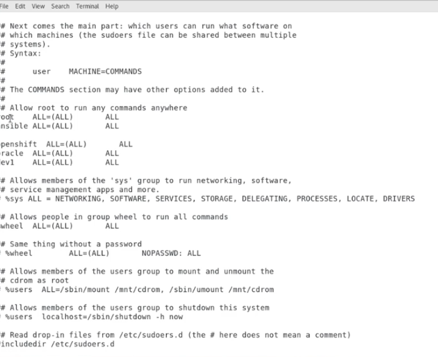

quitar el password cuando se vuelve sudo editaR SUDOERS y escribir NOPASSWD:ALL

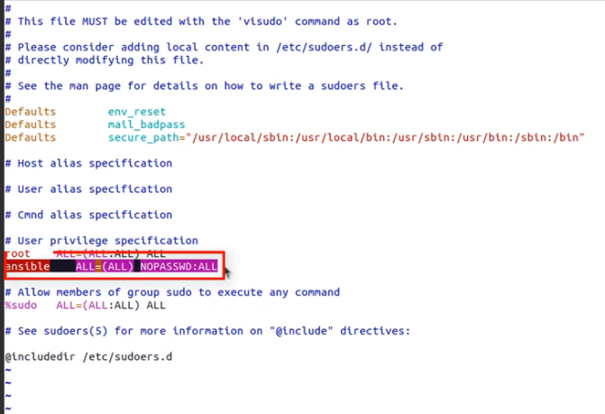


Configure el acceso de sudo para el usuario recién creado:
```
cat << EOF >/etc/sudoers.d/USER_NAME
$USER_NAME ALL = (root) NOPASSWD:ALL
EOF
```
Sustituya USER_NAME por el nuevo nombre de usuario para el usuario Ansible .

Asigne los permisos de archivo correctos al archivo nuevo:

```
chmod 0440 /etc/sudoers.d/USER_NAME
```

Sustituya USER_NAME por el nuevo nombre de usuario para el usuario Ansible .

## Escalada privilegios

La escalada de privilegios en Ansible se refiere a la capacidad de ejecutar tareas o comandos con permisos elevados en sistemas remotos. Esto es particularmente relevante en entornos de gestión de infraestructura donde es necesario realizar acciones administrativas que requieren privilegios adicionales, como instalar paquetes, reiniciar servicios, modificar archivos de configuración, entre otros.

En Ansible, la escalada de privilegios se puede lograr de varias maneras:

**Uso de sudo**: sudo es un comando de Unix/Linux que permite a los usuarios ejecutar comandos con los privilegios de otro usuario, comúnmente el superusuario (root). Ansible puede aprovechar sudo para ejecutar tareas con privilegios elevados en los sistemas remotos.

**Uso de become**: Ansible proporciona un parámetro llamado become que permite especificar que una tarea debe ejecutarse con privilegios elevados. El parámetro become puede tomar diferentes formas, como **become: yes** para usar sudo de forma predeterminada o **become: true** para indicar que se requiere la escalada de privilegios sin necesariamente usar sudo.

Uso de **become_user**:** Además del parámetro become, Ansible proporciona become_user para especificar el usuario con el que se debe ejecutar la tarea con privilegios elevados. Esto es útil cuando se necesita ejecutar comandos como un usuario específico con privilegios de sudo.


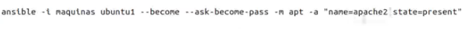

## Ficheros de Configuracion

- Ansible tiene un fichero denominado "ansible.cfg" donde ponemos los valores por defecto de nuestro ansible
- En realidad esta formado por un conjunto de opciones y propiedades que ya tienen un valor predefinido y que yo necesito cambiar a través de este fichero
- Por tanto solo necesito modificar el fichero si quiero cambiar algún valor original

**Donde encontrar el fichero de config**

Este fichero se puede encontrar en los siguientes sitios:

 - ANSIBLE_CONFIG variable de entorno
 - Ansible.cfg en el directorio actual
 - ~/.ansible.cfg En el directorio home del usuario
 - /etc/ansible/ansible.cfg


Para crear un fichero config se puede usar este comnado
```
ansible-config init --disabled > ansible.cfg
```
o con todos los plugins
```
ansible-config init --disabled -t all > ansible.cfg
```

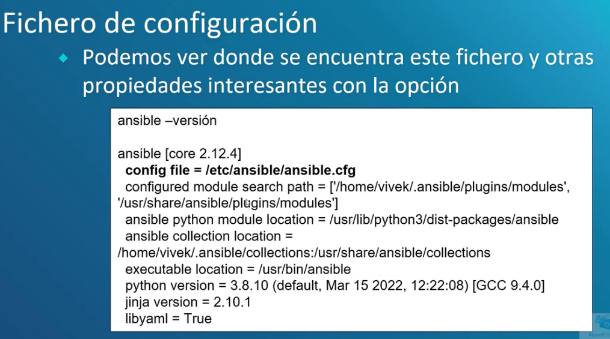

## Inventarios


se pueden usar varios formatos como ejemplo ini o YAML

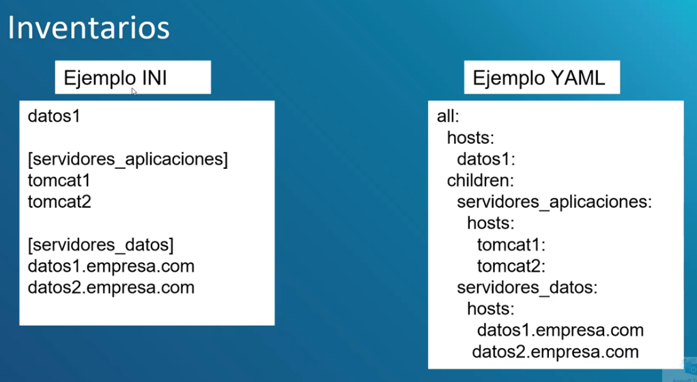

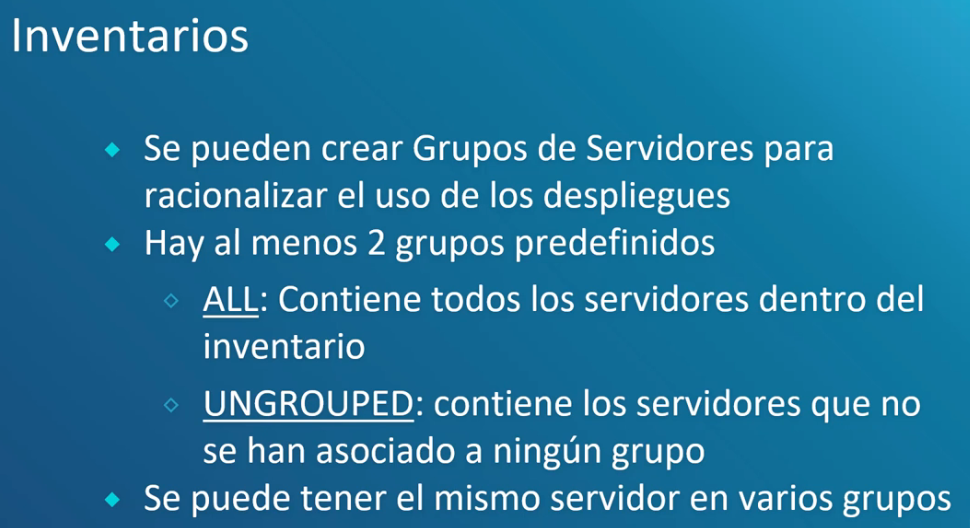

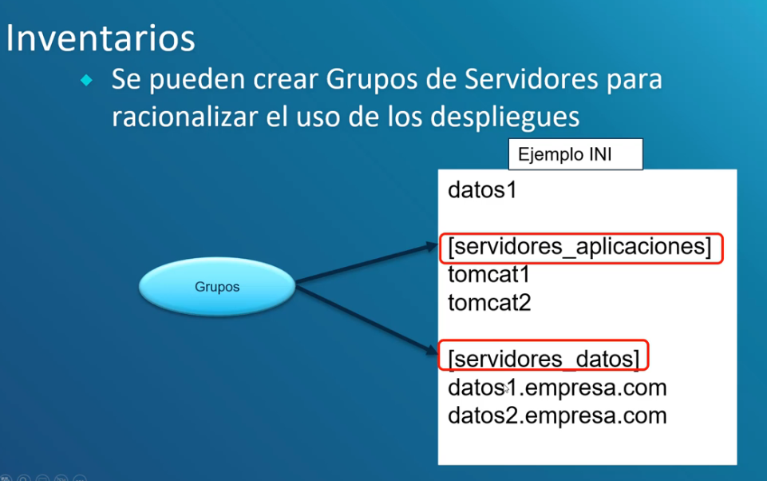

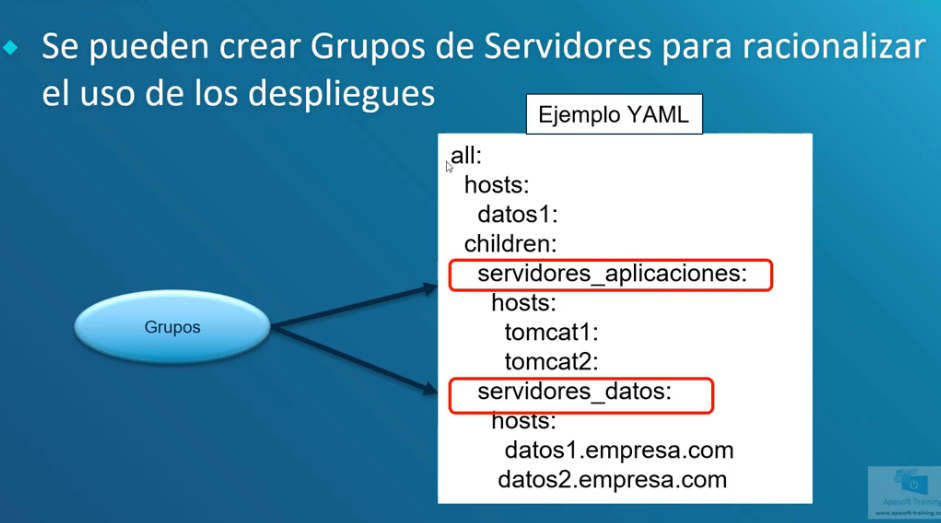

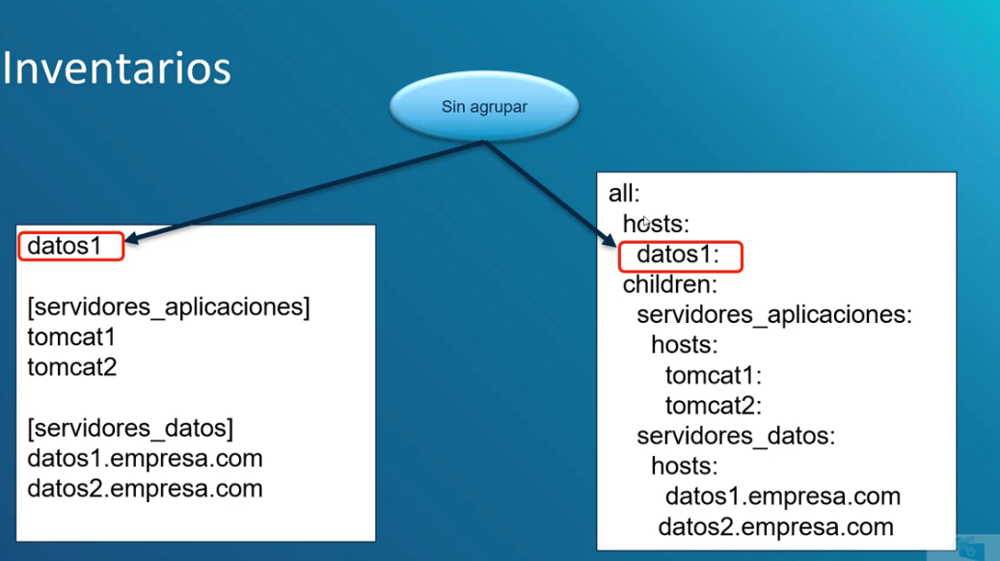

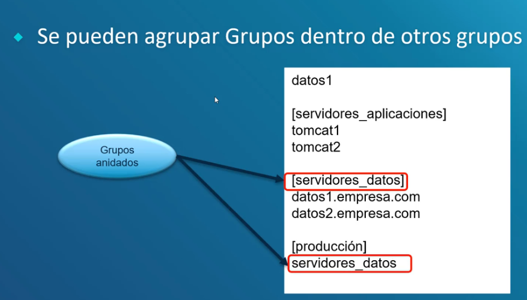

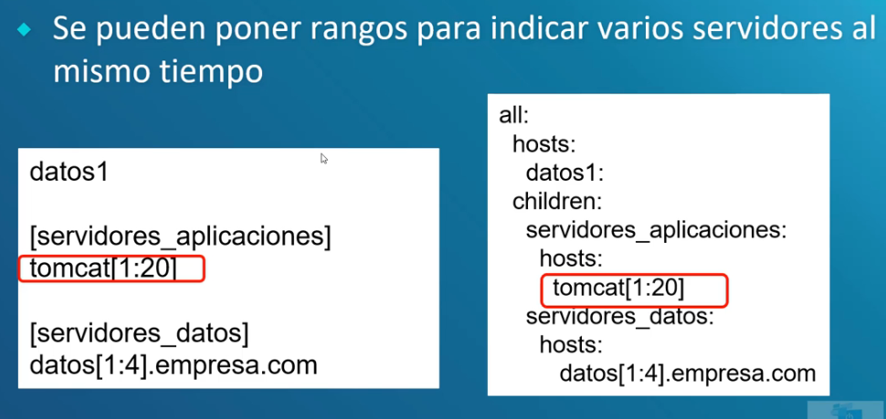

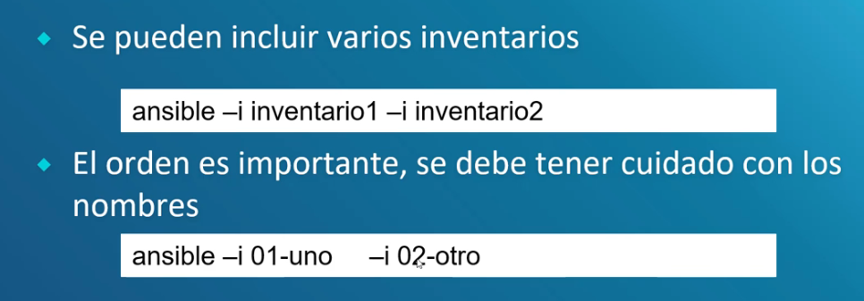
