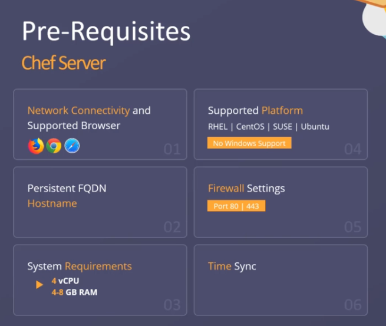
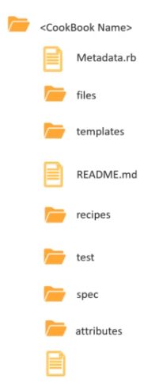

# Chef

- is declarative language

Push (ansible and saltstack) pull (cheff and puppet)
In the push model an authority, a manager or lead, assigns the tasks to team members (order at restaurant). In the pull model each team member decides which tasks to take on. (buffet)

idempotency: the result of the operation its the same

## Introduction Chef

- Chef is ruby based
- two deployment models
    - Chef-Zero: development
    - Server-Client: production
- Chef server linux only
- Chef client linux and Windows
- Chef is declarative, higly available and increased productivity

## Setup Chef

- Chef server
    - Open source (chef server)
    - On prem enterprise Chef (chef server with support and premium features)
    - Multi-tenant Cloud Soluction (Hosted Chef server)



## Chef workstation

Chef development kit

## Chef Arquitecture


Chef Workstation allows you to author cookbooks and administer your infrastructure. Chef Workstation runs on the computer you use everyday, whether it is Linux, macOS, or Windows.

Chef Workstation ships with Cookstyle, ChefSpec, Chef InSpec, and Test Kitchen testing tools. With them, you can make sure your Chef Infra code does what you intended before you deploy it to environments used by others, such as staging or production.

Once you’re done developing and testing code on your local workstation, you can upload it to the Chef Infra Server. The Chef Infra Server acts as a hub for configuration data. It stores cookbooks, the policies that are applied to the systems in your infrastructure and metadata that describes each system. The knife command lets you communicate with the Chef Infra Server from your workstation. For example, you use it to upload your cookbooks.

Chef Infra is constructed so that most of the computational effort occurs on the nodes rather than on the Chef Infra Server. A node represents any system you manage and is typically a virtual machine, container instance, or physical server. Basically, it is any compute resource in your infrastructure that’s managed by Chef Infra. All nodes have Chef Infra Client installed on them, and Chef Infra Client is available for multiple platforms including Linux, macOS, Windows, AIX, and Solaris.

Periodically, Chef Infra Client contacts the Chef Infra Server to retrieve the latest cookbooks. If (and only if) the current state of the node does not conform to what the cookbook says it should be, Chef Infra Client executes the cookbook instructions. This iterative process ensures that the network as a whole converges to the state envisioned by business policy.

## Chef terminology

### Resources

https://docs.chef.io/resource/

A resource is a statement of configuration policy that:

- Describes the desired state for a configuration item
- Declares the steps needed to bring that item to the desired state
- Specifies a resource type—such as package, template, or service
- Lists additional details (also known as resource properties), as necessary
- Are grouped into recipes, which describe working configurations

**Resource Syntax**
A resource is a Ruby block with four components: a type, a name, one (or more) properties (with values), and one (or more) actions. The syntax for a resource is like this:

```
type 'name' do
  attribute 'value'
  action :type_of_action
end
```
Every resource has its own set of actions and properties. Most properties have default values. Some properties are available to all resources, for example those used to send notifications to other resources and guards that help ensure that some resources are idempotent.

For example, a resource that is used to install a tar.gz package for version 1.16.1 may look something like this:

```
package 'tar' do
  version '1.16.1'
  action :install
end
```
https://docs.chef.io/resources/

**CHEF DSL**

```
<Resource Type> '<NAME>' do
    <Attribute> '<Value>'
    <Attribute> '<Value>'
    <Attribute> '<Value>'
    <Action> :<Value>
end
```

### Recipe

A recipe is the most fundamental configuration element within the organization. A recipe:

- Is authored using Ruby, which is a programming language designed to read and behave in a predictable manner (file with .rb extension)
- Is mostly a collection of resources, defined using patterns (resource names, attribute-value pairs, and actions); helper code is added around this using Ruby, when needed
- Must define everything that is required to configure part of a system
- Must be stored in a cookbook
- May be included in another recipe
- May use the results of a search query and read the contents of a data bag (including an encrypted data bag)
- May have a dependency on one (or more) recipes
- Must be added to a run-list before it can be used by Chef Infra Client
- Is always executed in the same order as listed in a run-list

the code creation of a recipe has the follow steps:

- Create
- Check: to validate the write code you can use this command
```
coockstyle <Recipe File>
```
- test (local mode is use when you are on chef-zero )
```
chef-client --local-mode --why-run <Recipe File>
```
- Run
```
chef-client --local-mode <Recipe File>
```

### Cookbook

A cookbook is the fundamental unit of configuration and policy distribution in Chef Infra.

A cookbook defines a scenario and contains everything that is required to support that scenario:

- Recipes that specify which Chef Infra built-in resources to use, as well as the order in which they are to be applied
- Attribute values, which allow environment-based configurations such as dev or production.
- Custom Resources for extending Chef Infra beyond the built-in resources.
- Files and Templates for distributing information to systems.
- Custom Ohai Plugins for extending system configuration collection beyond the Ohai defaults.
- The metadata.rb file, which describes the cookbook itself and any dependencies it may have.

A cookbook is comprised of recipes and other optional components as files or directories.

Directory strructures of a cookbook



|Component	|File/Directory Name|	Description|
|-|-|-|
|Recipes	|recipes/ |	Store all the recipes files,May be included in another recipe, inside each recipe folder you find a file with the name default.rb  |
Attributes|	attributes/|	An attribute can be defined in a cookbook (or a recipe) and then used to override the default settings on a node. When a cookbook is loaded during a Chef Infra Client run, these attributes are compared to the attributes that are already present on the node. Attributes that are defined in attribute files are first loaded according to cookbook order. For each cookbook, attributes in the default.rb file are loaded first, and then additional attribute files (if present) are loaded in lexical sort order. When the cookbook attributes take precedence over the default attributes, Chef Infra Client applies those new settings and values during a Chef Infra Client run on the node.|
Files|	files/|	A file distribution is a specific type of resource that tells a cookbook how to distribute files, including by node, by platform, or by file version.|
Libraries|	libraries/|	A library allows the use of arbitrary Ruby code in a cookbook, either as a way to extend the Chef Infra Client language or to implement a new class.
Custom Resources|	resources/|	A custom resource is an abstract approach for defining a set of actions and (for each action) a set of properties and validation parameters.|
Templates|	templates/	|A template is a file written in markup language that uses Ruby statements to solve complex configuration scenarios.
Ohai Plugins|	ohai/|	Custom Ohai plugins can be written to load additional information about your nodes to be used in recipes. This requires Chef Infra Server 12.18.14 or later.
Metadata	|metadata.rb	|This file contains information about the cookbook such as the cookbook name, description, and version.

the default path to the cookboks directory
can be found in 

cat /home/centos/chef-repo/.chef/knife.rb

**Cookbook Creation**

you can create the skeleton structure of a cookbock with the next commnad

```
chef generate cookbook <NAME of the Cookbook>
```

### RunList

A run-list defines all of the information necessary for Chef to configure a node into the desired state. A run-list is:

- An ordered list of roles and/or recipes that are run in the exact order defined in the run-list; if a recipe appears more than once in the run-list, Chef Infra Client will not run it twice
- Always specific to the node on which it runs; nodes may have a run-list that is identical to the run-list used by other nodes
- Stored as part of the node object on the Chef server
- Maintained using knife and then uploaded from the workstation to the Chef Infra Server, or maintained using Chef Automate

A run-list must be in one of the following formats: fully qualified, cookbook, or default. Both roles and recipes must be in quotes, for example:

```
"role[NAME]"
```
or

```
"recipe[COOKBOOK::RECIPE]"
```
Use a comma to separate roles and recipes when adding more than one item the run-list:

```
"recipe[COOKBOOK::RECIPE],COOKBOOK::RECIPE,role[NAME]"
```

Use an empty run-list to determine if a failed Chef Infra Client run has anything to do with the recipes that are defined within that run-list. This is a quick way to discover if the underlying cause of a Chef Infra Client run failure is a configuration issue. If a failure persists even if the run-list is empty, check the following:

- Configuration settings in the config.rb file
- Permissions for the user to both the Chef Infra Server and to the node on which a Chef Infra Client run is to take place

```
chef-client --runlist "recipe[cookbook-Name::Recipe-Name]"
```
chef choose de default recipe
```
chef-client --runlist "recipe[cookbook-Name]"
```