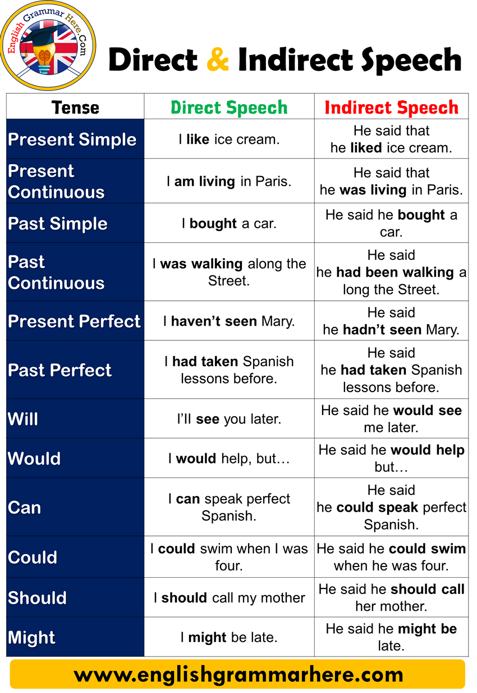

stilted: This refers to something that appears unnatural and funny from being too formal. The talk show host spoke very well, but his guest spoke in a stilted way.

"... you always had to speak to it in a very, kind of, stilted language ..."

follow-up: This refers to something that continues a process that has already begun. Jane sent a follow-up email to say that she wouldn't be able to attend the meeting after all.

"... it can respond to you with follow-up questions and statements ..."

resemble: To resemble something is to look or be like it. Mark's new home resembles his old apartment. Both have a minimalist theme.

"... questions that begin to resemble a real conversation ..."

interface: This refers to the hardware and software that let a person use a computer. The thing I like best about this phone is its touch-screen interface.

"... there usually was some sort of interface that you had to use in between."

stalling: Stalling is delaying on purpose because you need more time, usually to think or to do something. Clarissa is an expert at stalling. She engages clients in small talk until her boss is ready to meet them.

"Siri is very clever about stalling."

kind of: This is an informal expression that means "somewhat" or "to some small degree." I'm kind of worried about my upcoming presentation. I know it's good, but I'm not sure if the clients will get it.

"... you're being kind of kept waiting."

Grammar tip: The question words "where" and "how"

Questions words are used when asking about different things.

We use the question word where to ask about location:

"Siri, where are you from?"

Meanwhile, we use how together with certain words to ask about quantity, manner, procedure and length:

"How far away is Jupiter?"

"How old are you?"

More examples:

Where have you been?
Where did you put the folder?
Where is Leanne? She's not in her work station.

How bad was the car accident?
How long will the job interview take?
How much money do we have?

"Either ... or ..." is often used to talk about a choice between two possibilities.

You can have either tea or coffee.

Sometimes more than two choices are given.

Would you like to add some syrup to your coffee? You can have either mint, hazelnut or caramel.

An "either ... or ..." sentence must have a balanced structure, so that the same kind of words or expressions follow "either" and "or."

He's either in London or in Rome.
(In this sentence, "in London" and "in Rome" are prepositional phrases.)

"Either ... or ..." is used to talk about two or more choices.

An "either ... or ..." sentence must have a balanced structure, so that the same kind of words or expressions follow "either" and "or."

You can ask about a person's job:

What do you do in Company A?

If the person has mentioned that he/she has children, then it's okay to ask how many children he/she has, and what the children's ages are.

How many children do you have?
How old are they?

You can talk about other light topics:

How was your flight?

How was the traffic?

Do you like the weather?

Really? How many months along are you?

Hello. You two look familiar. Have we met before?

radiation: different kinds of energy in the form of waves or rays that people cannot see

The radiation from the sun warms the earth and the oceans.

"This is my crystal, feel the energy, the radiation."

shrink: an informal term for a psychologist or psychiatrist

Ivy is a professional psychiatrist who diagnoses and treats mental disorders; her friends jokingly call her a shrink.

"This is a 17th century, kind of Dutch portrait. It just looked exactly like my shrink."

monument: something that is built to give recognition and honor to a person, event or idea

The statue in the middle of the park is a monument to the city's founder.

"This is a 17th century, kind of Dutch portrait. ... That's my, sort of, monument to Dr. Block."

den: a room within a house, in which people can be informal and comfortable

Riel led his friends to the den, where they all talked and ate for hours.

"This is my den. I don't do anything in this room except watch TV with my husband and my dogs ..."

knick-knacks: small objects used for decoration

There are various knick-knacks on the bookshelf, such as small toys, painted sea shells, and ceramic cups and bowls.

"I don't do anything in this room except watch TV with my husband and my dogs, and adjust knick-knacks."

spirit animal: a metaphor that refers to someone or something that a person can relate to or admire

Ryan jokes that his spirit animal is a sloth, because he just wants to sleep and eat all day.

"Phyllis Diller is my spirit animal, basically."

Grammar tip: Relative clauses that start with "which"

A relative clause is a dependent clause that begins with a relative pronoun, such as who, whose, where, when and which.

A relative clause that starts with which gives more information about the noun that precedes the clause.

"My piano, which I don't play anymore."

"The toaster is inside the cabinet, which I don't necessarily like, but I don't hate."

More examples:

For the camping trip, Alana let Brent borrow a tent, which can accommodate two people.
Brett has flexible working hours, which allows him to go to work later than other employees.
Nora has an excellent attendance record, which positively affects her chances of being promoted at work.

Here are phrases you can use to conclude a conversation politely:

Well, here they are.
(Please) Tell me about ... tomorrow/next time/later.
So, congratulations to all of us.
Thank you for ...

Here are useful structures for saying something positive about a conversation:

Infinitives
I really want to know/hear/learn ... how/why/what ...
I hope to see you at/in/around ...

Adjectives with infinitives
It's so good to see you!
It's nice to talk to you again.

Verbs in the present perfect tense
It's been great getting to know you.
I'm so glad to have had this chance to chat.

The future continuous tense is also called the future progressive tense. It is used for a future action that will be continuously or regularly happening.

Don't be late! I will be waiting for you.
Starting next year, I will be flying to Germany every month.

It is also used for a future action that will be in progress when another event happens.

Kate will be interviewing someone when you arrive. Please wait for her in the reception area. 

It is also used for a future action that will be in progress by a specific future time.

At 6 p.m. next Monday, I am going to be closing the deal with the new client.

The future continuous tense is formed by combining: "will be" + verb + "-ing."

I will be leading this week’s meeting.
He will be joining the company next month.

The future continuous tense may also be formed by combining: "am/is/are going to be" + verb + "-ing."

I am going to be leading this week’s meeting.
He is going to be joining the company next month.

The future continuous tense is used to talk about a future action that:

will be continually or regularly happening

He will be meeting with the marketing team starting next week.
 
will be in progress when another event happens

I will be working on a project when the new employee arrives. Please give her the office tour.
 
to talk about a future action that will be in progress by a specific future time

By noon tomorrow, we will be closing the deal with the client.
The future continuous tense is formed by:

"will be" + verb + "-ing" OR "am/is/are going to be" + verb + "-ing"

------------------------
Adverbs of time tell us when an action or event happens. Some adverbs of time express:

past actions
yesterday
recently
 
actions being performed at present
currently
now
 
future actions/actions that come after other actions
eventually
soon
In a sentence, adverbs of time can be placed:

at the beginning or at the end of the independent clause;
before the verb, after the linking verb, or between the auxiliary verb and the main verb.

------------------
"Whether or not" is used when two alternatives are possible, and the same action is done or should be done in either case.

Inform the team whether or not you're going to be late.
OR
Inform the team whether you're going to be late or not.
(If you're going to be late, inform the team. If you're not going to be late, inform the team. Informing the team is important in both cases.)

Call the restaurant before 8 p.m. whether or not you want to keep your reservation.
OR
Call the restaurant before 8 p.m. whether you want to keep your reservation or not.
(If you want to keep your reservation, call the restaurant before 8 p.m. If you don't want to keep your reservation, call the restaurant before 8 p.m. Calling the restaurant is important in both cases.)

My colleague is going to resign whether or not her boss likes it.
OR
My colleague is going to resign whether her boss likes it or not.
(My colleague will resign even if her boss doesn't want her to.)

I'm going to finish this project whether or not you help me.
OR
I'm going to finish this project whether you help me or not.
(I'm going to finish this project even if you don't help me.)

"If" and "whether" are words that imply uncertainty. They are often used interchangeably in informal speech and writing, but in formal communication, it is better to remember the rules for using the two words.

"If"and "whether" may be used interchangeably in relation to yes or no questions. If you are in a formal communication context, it is better to use "whether."

"If" should be used when talking about a condition.

"Whether" is used when two or more options exist.

"Whether or not" is used when two alternatives are possible, and the same action is done or should be done in either case.

-----------

To show interest in a conversation, you may:

Ask for more information.
Tell me about it.
How did it go?
Really?
 
Express understanding.
That's nice.
Yes, indeed.
I agree.
 
Express emotion.
Oh my goodness!
Oh dear.
I'm so sorry.
You may use adjectives followed by an infinitive to express emotions.

I'm happy to know you're finally getting promoted.
Oh, I'm sorry to hear about your loss.
I'm relieved to see you're okay.

-----------------

Certain verbs are commonly used with infinitives and gerunds to talk about plans.

I plan to take up another degree in graphic design and animation.
I intend to develop my scriptwriting skills.
I'm thinking of putting my web design skills to good use. 
 
The first conditional is useful when talking about plans and possible results of actions.

If that doesn't work out, I will find a job as a comic book illustrator. 
If I get a degree in film, I can start shooting my own films.
 
While can be used to talk about two activities or events happening at the same time. 

I intend to refine my writing skills while I'm in this firm. 
 I'm thinking of getting a degree in film while shooting TV ads.

 _______________

 Conjunctions are used to connect words, phrases or sentences. Here are the nine most commonly used conjunctions in the English language:

and
but
or
because
so
so that
if
unless
when

_____________

We use conjunctions to connect words, phrases or sentences. Here is a list of commonly used conjunctions:

**Here are some commonly used conjunctions for showing time.**

"Before" connects an earlier action to a later action.

We checked the report before submitting it to our boss.

"After" connects a later action to an earlier action.

Therese left the office after our meeting ended.

"While" describes two actions happening at the same time.

Farrah read a book while waiting for her friends to arrive.

"When" means "at the time that."

I was busy writing an email when my colleague called.

"Whenever" means "every time that."

Feel free to ask for help whenever you have problems with the new software.

"Ever since" means "from the time that."

Sales have doubled ever since we launched our advertising campaign.

"Until" means "up to the time that."

We won't be hiring new agents until we are sure of production levels next quarter.

**for showing comparison**

"As" means "to the same degree."

The new manager is talented, as the previous one was.

"Than" means "to a greater degree." (follows a comparative adjective)

The new manager is more talented than the previous one.

**for showing contrast**

Though"/ "although"/ "even though" are all used to mean "in spite of the fact that."

You can't expect me to pay the same delivery fee even though you were two weeks late.

"Whereas" means "on the other hand."

We provide 24-hour customer service, whereas our competitors are available only from 8 a.m. to 5 p.m. every day.

______________

For + -ing 
Grammar > Prepositions and particles > For + -ing

**For + -ing: function**
We use for + the -ing form of a verb to talk about the function of something or how something is used:

I need something for storing CDs.

The PC is still the most popular tool for developing software systems.

**For + -ing: reason**
We use for + the -ing form of a verb to refer to the reason for something:

You should talk to Jane about it. You know, she’s famous for being a good listener. (A lot of people know she’s such a good listener.)

__For + -ing or to + infinitive?__

Warning:
We don’t use for + -ing to express our purpose or intention. We use to + infinitive:

We’re going to Lisbon to visit my aunt.

Not: We’re going to Lisbon for visiting my aunt. or … for visit my aunt.

He’s now studying to be a doctor.

Not: He’s now studying for to be a doctor. or … for being a doctor.

You don’t need to bring anything. There’ll be sandwiches to eat and juice to drink.

Not: There’ll be sandwiches for eat and juice for drink.

______________

- The verbs think, feel, believe and find are useful for politely talking about opinions of past events.
    - I think/thought (that) ...
    - I feel/felt (that) ...
    - I find/ found the … (adjective).

- Add more details to your description by using relative clauses.

Toby attended the reunion concert of Little Contentment, a rock band that was very famous in the ‘70s.
Little Contentment promoted their new album, which will be released in February next year.
Most of the people who attended the seminar were also newly promoted managers.

- Certain adjectives can be used with infinitives to express feelings and reactions.
    - Fans were willing to stand for the whole show.
    - She is now better prepared to handle her team.

___________________

porter: a person whose job is to take care of a building, usually by cleaning or repairing it

come back to (something): to return to something that was done or mentioned earlier

___________

I have learned that …

I have learned that hard work is just as important as intelligence.

My experience has taught me …

My experience has taught me that I can accomplish anything I persevere at.

I have recently …

I have recently finished a project for the government's budget management office.

I worked as a …

I worked as a junior marketing executive for several years.

My career goals are/include …

My career goals are finishing my graduate studies and teaching at a university.
My career goals include finishing my graduate studies and teaching at a university.

For the next … years, I will …

For the next two years, I will work while earning my certificate in teaching.

____________

FOSTER (SOMETHING)
to help something, such as an idea or principle, grow or develop

Going on team-building activities helps to foster communication and teamwork between co-workers.

TO GO TO THE HEART OF (SOMETHING)
to create or strengthen an alignment between two actions, or between a problem and a solution

The company's new online business model goes to the heart of the firm's mission to provide fast and convenient customer service.

In … years, I see myself as …

In seven years, I see myself as the associate vice president of a respected consulting firm.

You may use the present perfect tense when talking about experiences related to your career goals.

- My experience has taught me ...
- I have recently finished ...
- I have learned that ...

_______________________

"Neither ... nor ..." is used for negations (statements that refuse or deny something).

- "Neither ... nor ..." connects two or more negations.
 
- When two subjects are connected by "neither ... nor ...," the verb follows the number of the subject closer to it.
 
- "Neither" and "nor" must always go immediately before the ideas they are joining.
 
______________________

- Certain verbs are commonly used with gerunds and infinitives to express preferences.

    I prefer to be relaxed.

    I prefer having minimal supervision.

    I would prefer to work with people my age.

    I like to look professional.

    I like working with older and more experienced people.

    I would like to receive clear and specific directions from my supervisor.

    I don't mind having a strict dress code.
 
- Would rather is used to express a preference between two choices.

    I would rather work with older people.

    I would rather follow a dress code than wear a uniform.
 
- Conjunctions are useful for stating choices and explaining preferences.

    I prefer to be relaxed, but I would also like to look professional.

    Do you like working with people your age or people who are older and more experienced?

    I would rather work with people my age because it's easier to relate to my peers.

I like ...

I like having a schedule for everything I need to do.

I would rather (verb without "to") than (verb without "to") ...

I would rather work alone than work in a team.

I prefer (verb + "-ing") ...

I prefer drinking iced coffee.

I prefer ("to" + verb) rather than (verb without "to") …

I prefer to wear casual attire rather than wear a suit.
______________________________

- Here are useful phrases when expressing preferences as a client:

    I like/want ...

    I would like (to) ...

    I prefer ... (to) ...

    I would rather ... (than) ...
    
- We can use both gerunds and infinitives with like and prefer to express preferences.

    I like/prefer to wear casual clothes.

    I like/prefer wearing casual clothes.
    
    I prefer cooking my own food to eating out. 

_____________________________________

Grammar tip: The past continuous tense

The past continuous tense is also called the past progressive tense. The past continuous tense is used to talk about a continuing action in the past.

The past continuous tense can also be used to talk about two or more past actions happening continuously at the same time.

The past continuous tense is formed by was/were + verb + -ing.

"What I was discovering is that as I was falling in love with this thing, it was also dying."

"... I was trying to find a way to spend my life doing this thing."

More examples:

Clarisse was preparing dinner when her husband came home.

As Dan was opening his gift, he saw that he received a watch he already had.

Tin was preparing for her presentation as her coworker was starting the team meeting.

____________________________

Here are useful phrases for talking about fashion and clothing preferences.
I (usually/often/always) wear...
You'll (usually/often/always/never) see me in...
I'm a (big) fan of...
I prefer…(to…)
I'd rather wear…(than…)
I accessorize (my outfits) with...

We can also use gerunds and participles to talk about fashion and clothing preferences.
I love/don't like wearing...
You'll always/never see me wearing...
 __________________

Droop by -> pasate por

____________________

BEHEMOTHS
very large and powerful groups, companies, etc.

Automotive industry behemoths hold expensive and elaborate motor shows during the annual automotive trade fair.

REAPED
gained something as a result of one's actions

The fashion chain reaped large profits from the sale of its clothes which were recently featured in a very popular movie.

BLOSSOM
fully develop into something

The wine industry is expected to blossom in a few years as the increasing global demand enables winemakers to expand and increase production.

BY ANY MEANS
in any possible way

Bert is not by any means unfamiliar with using the photo editing program since he uses an older version of it at work.

GASTRONOMY
the art or science of preparing and eating good food

Alan is very interested in gastronomy. He eats at different restaurants then posts his opinions about the food online.

ARTISANS
people who are skilled at making things, often by hand

Several artisans work at the ceramics house creating porcelain vases and sculptures.

COVETED
refers to things that other people want to have

Dan got a coveted job as a designer and product planner at a world-famous fashion design firm.

HONED
perfected

The sculptor honed his skills through years of practice.

UBERIZED
Uberized refers to a service that changed because of the introduction of a new way to buy or use the service using technologies such as smartphones.

________________________

The present perfect tense links the past and the present.

The present perfect tense is formed by "has/have" + the past participle of the verb.

The present perfect tense is used to:

- say that a past action is still related to the present
- say that you have done or experienced something in the past
- say that you have never done or experienced something before
- talk about change that happened over a period of time

The negative form of the present perfect tense, "have not"/"haven't," is used to say that an action or event that we expected has not happened yet. Using the present perfect tense suggests that we are still waiting for the action or event.

_____________________

The present perfect continuous tense is formed by combining "has/have" + "been" + verb + "-ing."

We use the present perfect continuous for the following purposes:

- to talk about an action that started in the past but is still happening at present
- to talk about actions that happen repeatedly, from a past time up to the present

_____________

- I have had this … since …

    I have had this headache since yesterday.

- … has felt … since …

    Harry has felt nauseated since lunchtime.

- … has been suffering from … for …

    Layla has been suffering from a fever for nearly a day now.

- … has been experiencing bouts of … for …

    Mary has been experiencing bouts of dizziness for the past hour.

- If your … is bothering you, you may want to take …

    If your headache is bothering you, you may want to take painkillers.

- If his/her … does not stop soon, he/she may want to …

    If Harry's nausea does not stop soon, he may want to see a doctor.

- If his/her … does not go away, he/she ought to start taking …

    If Layla's fever does not go away, she ought to start taking antibiotics.

- If he/she continues to feel …, he/she should …

    If Mary continues to feel dizzy, she should take a nap at the lounge.

_____________________

Listed below are the different forms and uses of "have to."

Use "have to" + base verb to talk about a habitual or present obligation.
 
Use "have got to" + base verb to talk about obligation more strongly than "have to" and to express certainty.
 
Use "will have to" + base verb to talk about a future obligation or necessity.
 
Use "do not/don't have to" + base verb to say that there is no obligation or necessity.
__________________________

under the weather - sick

I'm not coming to work today because I am feeling under the weather.

coming down with - becoming sick with

I think I am coming down with the flu.

bout of/with - a period of illness

I have just recovered from a bout with chicken pox.

- Here are phrases you can use to talk about health problems.
I'm feeling under the weather.
I'm coming down with...
I had (a) bout/s of/with...

- The present perfect and present perfect continuous tenses are useful for talking about a person's health condition.
I've had/been having...since/for...
I've been feeling...since/for...
I've just recovered from...

_________________

The following is a list of dental terms:

Kinds of dental problems

wisdom tooth
caries
impacted tooth
plaque
Kinds of dental treatment

amalgam
bridge
filling
radiograph
root canal therapy
veneer

_____________

DEGENERATIVE
referring to a disease that slowly destroys parts of the body to stop them from working

When struck by a degenerative disease, the body becomes unable to replace dead cells with new ones, causing organs to stop working.

HALTING
stopping

A sudden increase in foreign investments provided employment to many people, effectively halting an economic recession.

PROGRESSION
development over time

Chemotherapy prevents the progression of cancer by killing cancer cells before they spread to other organs.

JUVENILE
young or undeveloped

Despite its current reach of 40 million people, the comic series had a little more than a hundred readers back in its juvenile days.

SIDESTEPPING
avoiding dealing with or discussing a problem

Members of the Congress are voting for the bill while sidestepping controversies that came with it.

QUALMS
worries or feelings of uneasiness, often caused by doubt regarding a decision or situation

The singer's loyal fans had qualms with the sudden change in her music style.

_____________

**MUST**

"Must" talks about obligation and duty where there is no other choice.

Companies must pay their employees for their work.
You must deposit a minimum of $25 to open a bank account.

In its negative form, "must" talks about a definite obligation to not do something.

You must not use the meeting room without a reservation.
You mustn't forget to check the data listed in your report.

To express that there is no obligation, we use "do/does not have to" instead of "must not."

I will be late to our meeting. You don't have to hurry.
It's not an important decision; you don't have to include it in the report.

"Must" is used to express a confident guess.

She went to bed early; she must be tired.
Ethan seems so happy. He must be enjoying his new job.

"Must have" + past participle expresses a confident guess about a past event.

She went to bed early last night; she must've been tired.
Ethan used to look so sad. He must have hated his old job.

In its negative form, "must" can also express a confident guess that something is not true.

The dog isn't eating its food; it must not be that hungry.
Carol always looks so relaxed at the end of the day. Her job mustn't be very hard.

"Must" is a modal that is used to:

- express obligation
You must show an ID.
He must be paid when the job is done.
 
- give a confident guess
Wendy’s absent; she must be sick.
The restaurant is always full; it must have good food.

____________________

"Should" and "ought to" talk about obligation and duty.

Companies should take care of their employees.
Employees ought to do their jobs well.

"Should have" + past participle or "ought to have" + past participle can be used to talk about past obligations that you did not do.

We should have been more careful in analyzing the research data.
Vicki ought to have paid more attention to the caller. Now she has forgotten his name.

In their negative form, "should" and "ought to" talk about obligations to not do something.

You should not be late for work.
You ought not argue with a client./You ought not to argue with a client.

___________________________

Use "so" before adverbs, quantifiers and adjectives without nouns.

When used with adverbs, "so" also becomes an adverb.

I woke up so early today.

"So" can also be used before quantifiers (few, little, much, many).

He got so little rest last night.

As an adverb, "so" can be used before adjectives not followed by nouns.

That house is so big.

For comparative adjectives, use "so much," not just "so."

CORRECT: His house is so much bigger than my house.
INCORRECT: His house is so bigger than my house.

"So" and "such" are both used to add emphasis to a description.

Use "such" before nouns. These nouns may or may not have adjectives.

Such a meal is good for you. (no adjective)
Such a healthy meal is good for you. (with adjective)

"So" and "such" are both used to add emphasis to a description.

We use "so" before adverbs, quantifiers and adjectives without nouns.

We use "such" before nouns. These nouns may or may not have adjectives.

______________________

"Some" is used to say that you have something.

I have some tickets to the concert.

"Any" is used to say that you do not have something.

The ticket seller doesn't have any tickets left.

"Some" is used to say that you want something.

She wants some pancakes for breakfast.

"Any" is used to say that you do not want something.

The man didn't want any sugar in his coffee.

"Some" is used to offer or request something politely.

Would you like some tea?
I would like some tea, please.

"Any" is used to ask if something is present or available.

Is there any tea in the kitchen?

"Some" is generally used in a positive sense.

"Any" is generally used in a negative sense.

___________________

plug a gap: to provide what is missing from something

womb: the organ in women in which babies develop before birth

It takes a baby nine months to fully develop in the mother's womb.

"... the same as her mother's womb."

Grammar tip: Compound adjectives

Compound adjectives contain two or more words that, taken together, function like adjectives. An adjective does not necessarily have to be part of the combination.

The words in a compound adjective are usually separated by a hyphen.

Here are some examples from the video:

"Until reaching the safe 2.5-kilogram mark, she'll need to..."

"Luckily, this family discovered a free home-based incubator service..."

"This fact has only strengthened the professor's determination to continue his life-saving work."

More examples:

The manager approved Helena's well-planned project proposal.
A new law would be passed if it has two-thirds majority vote of the governing body.
The town's demographic is mostly composed of middle-aged people ages 30 to 55.

_______________________

blood chemistry
complete blood count/CBC
urinalysis
fecalysis
electrocardiogram/ECG/EKG
ultrasound/sonogram
medical history 
medical screenings
outpatient procedure

outpatient procedure

medical procedures that are done quickly and don't require patients to stay overnight in the hospital

__________

When starting a fitness program, you may encounter the following terms:

body mass index (BMI) 
cardio-respiratory endurance 
diastolic blood pressure 
exercise log 
flexibility 
muscular endurance 
obese
progressive overload 
systolic blood pressure
target heart rate (THR) zone 
________________________

KEPT (SOMETHING) AT BAY
prevented something from having an effect on a person or thing

Eating an energy bar every morning kept Miguel's hunger at bay.

INDULGING
allowing oneself to enjoy something

After a busy week at work, Jean relaxes by indulging in good food and a movie.

HAIRDO
the style, including the cut, color, etc., of someone's hair

The bob cut is a popular hairdo for busy women since it is easy to maintain.

PASSES THE TIME
allows one to enjoy time that would be boring otherwise

Flight attendants sometimes wait hours in between flights; touring the city they are currently in passes the time.

A STONE'S THROW
very near or short distance

Sharlene watches a lot of films because the cinema is a stone's throw from her home.

EMIGRATED
left one's country to live in a different country permanently

The house is cheap since the owners emigrated and want to sell it quickly.

EXERTION
use of physical effort

The group's immense exertion during the three-day hike left them tired and sore.

PHONY
false or fake

The job offer Erica got last week turned out to be a phony one.

AT TIMES
occasionally

At times, traffic gets so bad that a drive which normally takes 30 minutes can take two hours or more.

_____________________

widespread: very common in many places or among many people

Technology companies are widespread in the United States' Silicon Valley.

"Going to the gym or to a yoga class on your lunch break is widespread in Sweden."

mandatory: required by law, a rule, or an authority

Yearly medical checkups are mandatory in many companies.

"... pushing this practice to the extreme and making exercise on the job mandatory ..."

staying in shape: maintaining one's physical fitness

Kara lifts weights and rides her bicycle because she enjoys staying in shape.

"In Sweden, staying in shape is seen as every person's responsibility to society."

stigmatized: regarded in a disapproving way

The organization held programs designed to welcome employees from all backgrounds, in order to keep anyone from being stigmatized.

"Those who don't take care of themselves risk being mocked or stigmatized."

stand up to (something): to oppose something or maintain one's principles despite a challenge

Andrew decided to stand up to his coworker's difficult attitude by bringing the matter to their manager for resolution.

"... but rather to find ways to stand up to this kind of culture, to dare to question it ..."

vehement: forceful or powerful

Daniel expressed vehement disagreement with the new business plan, arguing that it was a bad idea and would lead to financial problems.

"... a workplace that is not characterized by this very vehement idea that everyone has to exercise."

subsidizing: helping to pay for the costs of something, such as an activity or project

The government is subsidizing the environmental group by helping pay for seeds and other equipment.

"Some big companies try to attract top new talent by subsidizing their sporting activities"

Grammar tip: Gerunds

Gerunds are words that appear to be verbs, but are used as if they are nouns. Gerunds are formed by using the base form of a verb and adding the suffix -ing.

"Going to the gym or to a yoga class on your lunch break is widespread in Sweden."

"Several studies show that doing exercise during your workday benefits both employees and employers ..."

"In Sweden, staying in shape is seen as every person's responsibility to society."

More examples:

Do you mind my asking you for some help on this project?
George believes that working hard is the fastest way for him to earn a promotion.
Anna thinks that sleeping early every night can help her wake up refreshed the next day.

_____________________

- "Since" is often used to say that an action began at a certain time and continues to the present.

I have lived in Japan since 1994.
Our company has been operating since 2001.

- "For" is used to give the time in which an action happens.

"For" is followed by the length of time in which the action lasts.

He has been our employee for five years.

- "During" is also used to give the time in which an action happens.

"During" is followed by the period of time in which an action happens.

He started working in the company during his last year of business school.

The prepositions "since," "for" and "during" are used to describe duration.

"Since" is used when an action began at a certain time and continues to the present.
"For" and "during" are used to give the time in which an action happens.

__________________

I fractured my (part of body) …

I fractured my ankle while I was jogging yesterday.

I scratched my (body part) …

I scratched my knee while I was playing football this morning.

I dislocated my (body part) …

I dislocated my shoulder in the gym last night.

I sprained my (body part) …

I sprained my ankle a few days ago, and it still hurts.

I got (kind of injury) from …

I got a mild concussion from the car accident.

My (body part) got …

My jaw got dislocated while I was sparring with my trainer last week.

I landed on my (body part) when …

I landed on my hip when I fell down the stairs.

When talking about accidents, it's important to describe actions and the sequence of events.

Use connecting words or conjunctions to describe what happened.

I fractured my ankle while I was jogging yesterday.
I landed on my hip when I fell down the stairs.
I need to wear the bandage until the wound heals.

_______________________

TREACHEROUS
dangerous and difficult

During the storm, the ship went through treacherous waters.

TERRAIN
land; a particular type of land

To reach the waterfalls, Marion would need to hike and travel through mountainous terrain.

ON THE EVE OF (SOMETHING)
the night before something, such as an event

On the eve of the competition, the dance group is still practicing for their performance.

BILLING
advertising; promoting

The XYZ Circus Company is billing itself as having "the most thrilling and entertaining performances in the world."

SEARCH AND RESCUE
the process of locating people and providing them with assistance after a disaster or accident

After the hurricane, civil groups immediately helped with search and rescue in the affected areas.

HUMANITARIAN
involving work that makes other people's lives better

Joel works in a humanitarian organization that provides education to children in poor communities.

GAITS
the manner or ways in which someone or something walks

Raleigh has a slower gait because he had a leg surgery recently.

PUT TO WORK
given a specific job or task

A project needs to be completed soon so the team was put to work immediately.

________________

Grammar tip: The zero and first conditional

Conditionals are sentences used to discuss hypothetical situations, and their effects or consequences. A conditional usually includes a conditional clause, also known as the if-clause.

The zero conditional is used when making statements about real or factual situations at the present time. It is formed by combining the condition (if + simple present tense), and the result (simple present tense.)

"But if birds know that there's a predator chasing them, they start to leave the area ..."

More examples:

If the temperature drops below zero, it snows.
Food spoils if it is in a hot place for several days.

The first conditional, also known as the "real conditional," is used when talking about possibilities and their results. The first conditional is formed by combining the condition (if + simple present tense), and the result (will + the zero infinitive).

"... even if the next generation comes through, they'll go, 'Well, I don't know why I don't want to go there ...'"

"If you can start to change where they nest ... the likelihood is they'll stay away as well ..."

More examples:

If Marty sees Jennifer tomorrow, he will tell her about the department's upcoming project.
The manager will sign the documents if it is delivered within the day.

_______________________________

Adverbs of place tell us where an action or event happens.

Some adverbs of place may show a specific direction.

The storm is moving south.
The street slopes downwards.
He is turning right at the corner.

Some common nouns may also be used as adverbs of place to show directions for movement.

I am traveling abroad.
They walked home from the train station.

Adverbs of place may talk about a non-specific location.

Let us eat out.
I put the file there.
Can we talk elsewhere?

Adverbs of place can be put after the verb in a sentence.

The employees walked out of the room.
The restaurant is located southeast of here.

Adverbs of place can also be put after the direct object.

You can just place the books there.
The speakers greeted the audience downstairs.

Adverbs of place tell us where an action or event happens. In a sentence, adverbs of place can be found after a verb or direct object.

To show direction
The train is heading east to the city. (after verb)
He threw the ball upwards. (after direct object)
 
To show location
She walked ahead of her friends. (after verb)
You can see the train there. (after direct object)

_____________

BOLSTER
to make something better or stronger

The marketing department is planning a campaign that will bolster the company's product sales.

HOSPITALITY
the friendly, generous and welcoming behavior towards guests or visitors

Family and friends usually stay at Ryan's house because he is known for his hospitality.

SPARSELY
in small numbers or amounts

Tana's office is sparsely furnished: it just has a desk, chair and her work computer.

ENCAMPMENT
a group of tents or shelters in one place, usually used by people who do not have a permanent home

After patrolling, the soldiers return to their encampment to eat and rest.

MODERNIZATION
the process of transforming something to make it adapt into the present time

High-rise buildings, condominiums, malls and multiple businesses and are some of the signs of modernization in the city.

NOMADIC
describing a group of people who move from place to place instead of staying in one place

The nomadic tribe settled in a valley at the foot of the mountain until the winter has passed.

HERITAGE
the culture, traditions, beliefs, etc., that are part of the history of a country or group of people

People are taught folk dances, songs and stories to preserve their heritage.

INDUSTRIALIZING
developing businesses from being primarily traditional to being based on manufacturing

Britain began industrializing in the 1780s, when steam power began to be used for running manufacturing equipment.

PRODUCTION LINE
the set of machines, equipment and people arranged to manufacture something

There was a pause in the production line because one of the machines stopped working properly.

RUNOFF
rainwater that is not absorbed by the ground and that flows into bodies of water, such as streams

The building has pipes that direct the flow of runoff to the sewers below the road.

IRRIGATION
the distribution of water on land through pipes or ditches to help in the production of crops

The irrigation of the farmland helped supply water to the fields during the dry seasons.

HEART
the central or most important area of something

The city capital is heart of the business and commerce of the country.

__________________

Here is a list of different vehicles used to transport goods:

By air

air carrier
combi
By sea

barge
ferry boat
liner
roll-on/roll-off (RORO)
tanker
vessel

________________

BITTERSWEET
refers to something that has both positive and negative aspects

The state of the country's economy is bittersweet, with a low unemployment rate but a shortage of labor.

GOOSE LAYING GOLDEN EGGS
a rich source of something valuable, such as financial income

The shipbuilding industry has been the goose laying golden eggs for the country's economy for more than 30 years.

MOUNTING
rising; increasing

The company's constantly mounting debt is a major cause of concern for executives, analysts, and investors.

STOP-GAP MEASURE
referring to a makeshift or temporary solution to address something that is lacking

As a stop-gap measure, the website's managers are blocking user access to problematic parts of the site until the issues can be fixed.

WRAPPED UP
finished

The trade show will be wrapped up with an awarding ceremony at the end of the week.

STUNT
to stop something from growing or developing

The long dry season will stunt the growth of crops, leading to fewer or lower quality harvests.

LEGACY
a situation in the present caused by something that happened in the past

The city's infrastructure, including coal plants and a rail transport system, is a legacy of its once powerful coal industry.

BAILOUT
financial aid provided to an organization or national economy to prevent it from collapsing

The struggling car company, which is one of the country's biggest employers, received a bailout worth billions of dollars from the government.

_____________________

I would like to book a flight to (destination) for (date or day).

I would like to book a flight to Bucharest for October 9/the 9th of October.
I would like to book a flight to Bucharest for Wednesday.

Could you please book me on a flight to (destination) for (date or day)?

Could you please book me on a flight to Athens for October 12/the 12th of October?
Could you please book me on a flight to Athens for Thursday?

Could you please check if (name of airlines) has any flights to (destination) on (date or day)?

Could you please check if BlueCloud Air has any flights to Prague on May 21/the 21st of May?
Could you please check if BlueCloud Air has any flights to Prague on Saturday?

I will be departing from (place of origin).

I will be departing from Tel Aviv.

Please book me for the (time) flight.

Please book me for the morning/afternoon/evening flight.
Please book me for the 3:20 p.m. flight.

How much does/would … cost?

How much does the ticket cost?
How much would an economy-class ticket cost?

one-way

I'd like to book a one-way flight to Shanghai.

NOTE: A one-way ticket allows you to travel to your destination but does not let you return home.

round-trip

I'd like to buy a round-trip ticket to Dubai.

NOTE: A round-trip ticket lets you travel to your destination and return home.

(For round-trip flights) I will be returning on (date or day).

I will be returning on Sunday.
I will be returning on December 21/the 21st of December.

____________________________

Ladies and gentlemen, may we have your attention, please?

Ladies and gentlemen, this is ... speaking.

Ladies and gentlemen, this is your captain speaking.

We are sorry to announce that ... has delayed flight ...

We are sorry to announce that a snow storm in London has delayed the following flights.

Flight ... will be rescheduled/delayed/canceled due to …

This flight will be delayed for two hours due to technical aircraft issues.

We regret to inform you that this flight has been canceled …

We regret to inform you that this flight has been canceled.

On behalf of ... I would like to apologize for …

On behalf of Creatas Pacific, I would like to apologize for the delay of your flight.

We've received word of ... Because of this ... has been canceled/rescheduled/delayed.

We have received word of a thunderstorm approaching the area that we will be passing through. Because of this, we regret to inform you that this flight has been canceled.

When announcing a flight delay or cancelation, it is important to:

State the flight details
… Eastern Airlines flight 204 to Dubai, departing at 10 a.m. from gate 32 …
 
Explain the status and give the reason for the change
… will be delayed due to heavy air traffic.
… has been canceled due to the typhoon.
 
State other new information
… will now be departing at approximately 1:30 a.m.
 
Apologize
We are sorry for the inconvenience.

on behalf en nombre de

___________________

ailerons

located at the back edge or tailing edge of an aircraft's horizontal wings. They are used to make the aircraft bank or roll to the left or right.

elevators

connected to the horizontal stabilizers on the tail of a plane. They control the pitch or the upward and downward direction of the nose of a plane.

rudder

a thin blade attached to the vertical stabilizer or fin on the tail of a plane. It swings from side to side to turn the aircraft to the left or right on its vertical axis.

flaps

located at the trailing edge or back edge of a wing, in between the aileron and the body or fuselage of a plane. They are used to change the wing shape to increase lift or drag during takeoff and landing.

slats

located at the leading or front edge of the wings. They are used to increase the lift needed when an aircraft is maneuvering or landing.

trim tabs

plates connected to primary control surfaces such as ailerons, rudders and elevators. They are used to balance or increase the force a control surface is creating.

spoilers

long, moveable plate along the upper surface of an aircraft's wings. They are used when landing to increase drag and reduce lift.

Ailerons help an aircraft roll to one side, while the rudder ensures that the nose of the aircraft stays in position.

Spoilerons are types of spoilers that reduce the speed of an aircraft during a roll.

Wing flaps, located behind spoilers, can be found on almost every aircraft, but each type of flap has a specific function.

__________________

A gerund is a verbal. It is a word that is based on a verb but functions as a noun. It always ends in -ing.

A gerund phrase is made of a gerund plus other words related to the gerund.

smoking in public places
designing websites
reading blogs

A gerund phrase may include a direct object.

giving the report

It may include an indirect object (with the direct object).

giving him the report

A gerund phrase may include a preposition and an object of the preposition.

giving this project to him

It may also include other adjectives or adverbs.

giving this difficult project to him
suddenly giving this project to him

Here are some examples of how a gerund phrase may be used in a sentence:

- I appreciate your offering me this job.
- He is very good at designing websites.
- Her favorite part of the job is mentoring new employees.
- Smoking in public places is not allowed in some countries.
- Mark's hobby, reading blogs, has given him many insights on the job market.

A gerund is a word that is based on a verb but functions as a noun. It always ends in -ing. 

Here are ways to form a gerund phrase:

gerund phrase with a direct object
giving the report
 
gerund phrase with an indirect object
giving him the report
 
gerund phrase with a preposition and an object of the preposition
giving this project to him
 
gerund phrase with adjectives or adverbs
giving this difficult project to him

_________________

An infinitive is a verbal. It is based on a verb but functions as a noun, adjective or adverb. It is made up of "to" + base form of a verb.

An infinitive phrase is made of an infinitive + other words related to the infinitive.

Here are some examples of how an infinitive phrase may be used in a sentence:

To be the CEO of his own company has always been Robert's ambition.
We all need to find time for rest and relaxation.
My plan is to stay home the whole weekend.
Ethan fulfilled his dream to become a manager by the time he turned 30.
Our team worked hard to submit the report on time.

An infinitive phrase may include a direct object.

to write an email

It may include an indirect object.

to write the boss an email

It may include a preposition and an object of the preposition.

to write the boss an email for the meeting on Thursday

It may also include other adjectives or adverbs.

to write a long email to the boss
to quickly write an email to the boss

An infinitive is a verbal. It is based on a verb but functions as a noun, adjective or adverb.

Here is an example of how an infinitive phrase may be used in a sentence:

We all need to find time for rest and relaxation.
_____________________

COMMERCIAL FLIGHT
a journey that transports people and goods from one place to another using an aircraft

Various commercial flights to different cities arrive and leave the country every day.

ECONOMY
describing something that is inexpensive or costs less money

Keri is staying in an economy hotel: She booked a cheap room with a small bed and bathroom.

REVENUE
the money that a business receives from the sale of its goods and services

The XYZ clothing company doubled their revenue as their newest summer line became popular in the market.

LONG-HAUL
describing something that involves a long distance

Kenny and Eric are going on a long-haul trip, passing through multiple cities and driving through different U.S. states.

CABIN CREW
people whose job is to take care of passengers on an airplane

The cabin crew can provide food, drinks, blankets or pillows at a passenger's request.

PIONEERED
created or started the development of something first

In 1992, IBM pioneered the use of touchscreen technology on cellphones.

INDUSTRY STANDARD
an established and generally accepted requirement in a certain field

Microsoft Excel set the industry standard in spreadsheet software all over the world.

CONSOLIDATED
combined

Mari consolidated all of the meeting's important points in her notes.

STREAMLINING
making something more efficient through simpler and faster methods

Letting companies submit requirements online is a way of streamlining the permit approval process.

________________________

Welcome aboard ...

Welcome aboard!

What's your seat number, sir/ma'am?

What's your seat number, please?

Go straight down this aisle toward ...

Go straight down this aisle toward the back, please.

Please go to ...

Please go to the other aisle, turn left, and go forward a few seats.

You'll find ... on the left/right side ... 

You'll find 13-E on the left side.

(Seat number) is on the right/left side of the aisle.

4-C is on the right side of the aisle.

Thank you for flying ...

Thank you for flying with us!

Enjoy your stay in (name of city you've just landed in)!

Enjoy your stay in Bangkok!

We hope to see you again/you fly with us again!

We hope you fly with us again!

___________________

Would you like ...?

Would you like anything to drink?
Would you like an extra blanket?

Would you like anything else ... ? Some ... , perhaps?/Maybe some ... ?

Would you like anything else, sir? Some bread, perhaps?
Would you like anything else, sir? Maybe some bread?

I'll be (right) back with your ...

I'll be right back with your tea.

Yes, we do.
Yes, we have ...

Yes, we have some strawberry yogurt.

I'm afraid we don't, ma'am/sir. We do have ...

I'm afraid we don't, ma'am. We do have Earl Grey and peppermint tea.

I'm afraid we don't have any ... We do have ...

I'm afraid we don't have any chrysanthemum tea. We do have Earl Grey and peppermint.

How may I help you, ma'am/sir?

Is there anything else I can help you with, ma'am/sir?

How may I help you, ma'am/sir?

Is there anything else I can help you with, ma'am/sir?

Excuse me, ma'am/sir. Could you kindly ... ?

Excuse me, ma'am. Could you kindly wear your seatbelt?

Please/Kindly (describe what the passenger should do).

Kindly press the power button to turn on your video screen. Then, you can scroll through the channels by pressing the up and down buttons marked CH on your remote control. You can also adjust the volume by pressing the VOL buttons.

_________________________
# zero conditional

# first conditional
The first conditional describes what will happen if a condition is met.

If you prepare well, you will win the account.

The first conditional sentence is formed by combining a condition (simple present tense) + a result (simple future tense).

If you don’t lower the price, the client will reject the proposal.
Unless you lower the price, the client will reject the proposal.

The first conditional or "the real conditional" talks about real possibilities.

It is formed with a condition (simple present tense) + a result (simple future tense).

# second conditional

The second conditional is often called "the unreal conditional" because it is used for situations that are impossible or not likely to happen.

The second conditional describes an imaginary result for an unreal situation.

If I won the lottery, I would buy a big house.
If we had a billion dollars, we would set up a movie production company.

The second conditional sentence is formed by combining CONDITION ("if" clause using the simple past tense) + RESULT (main clause using "would" + main verb).

If I were rich, I would quit my job.

We can contract "would" into "'d," and "would not" into "wouldn't":

I'd lower taxes if I were* the president.
He wouldn't lower taxes if he were* the president. 

*Although some people use "was" in second conditional statements, the more correct verb to use for both singular and plural nouns/pronouns in the second conditional is "were."

The second conditional is used for situations that are impossible or not likely to happen.

The second conditional is formed by combining the CONDITION ("if" clause using the simple past tense ) + RESULT (main clause using "would" + main verb).

# third conditional

The third conditional is often called "the past conditional" because it concerns only past situations.

It is used to talk about a past result that can no longer exist because the chance for its condition to be fulfilled has passed. There is always an unspoken "but ..." phrase.

If Greg had saved more money, he would have bought a bigger car.
(... but Greg did not save more money.)

You would have met the deadline if you had worked harder.
(... but you did not work harder.)

The third conditional sentence is formed by combining CONDITION ("if" + past perfect) +  RESULT (the main clause using "would" + "have" + past participle).

If we had arrived earlier, we would have been able to buy tickets.
If their goalkeeper had not been so good, we would have won the game.

An alternative form to "If ... had/had not ..." is "Had … would have …".

Had Greg saved more money, he would have bought a bigger car.
Had you worked harder, you would have met the deadline.

The third conditional is used to talk about a past result that is no longer possible. It follows the format:

CONDITION ("If" + past perfect) + RESULT ("... would have …" + past participle)

If you had arrived earlier, you would have seen the presentation.
If we had waited longer, we would have been caught in the rain.

# conditional mixt

# Conditionals using could

__________________________

pronunciacion https://www.adurcal.com/enlaces/ingles.htm

https://englishlive.ef.com/es-mx/blog/tips-para-estudiar/reglas-de-fonetica-para-leer-y-escribir-hablar/

https://global-exam.com/blog/es/general-english-reglas-de-pronunciacion-del-ingles-cuales-son/

https://www.inglesmundial.com/Pronunciacion-en-Ingles.html

________________________

# Reportes speech

