# Maven

- herramienta de compilacion
- herramienta para la gestion de dependencias en un proyecto
- herramienta de documentacion de proyectos

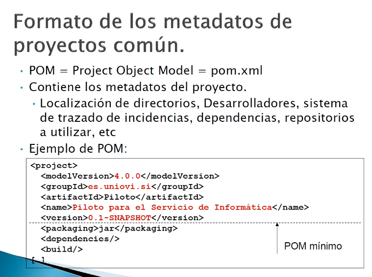

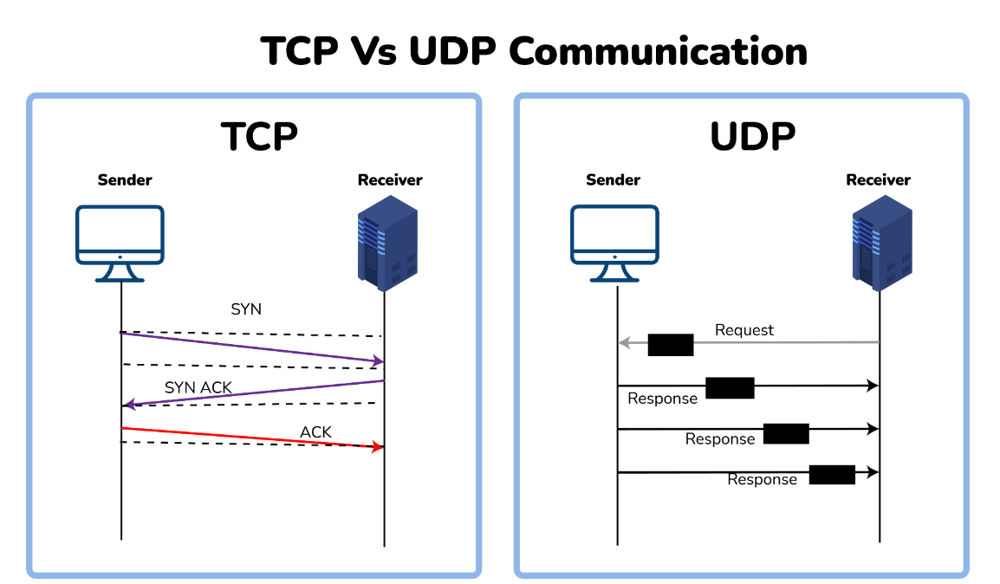

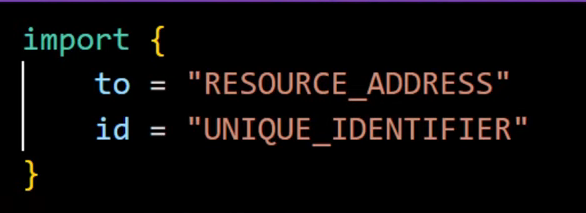

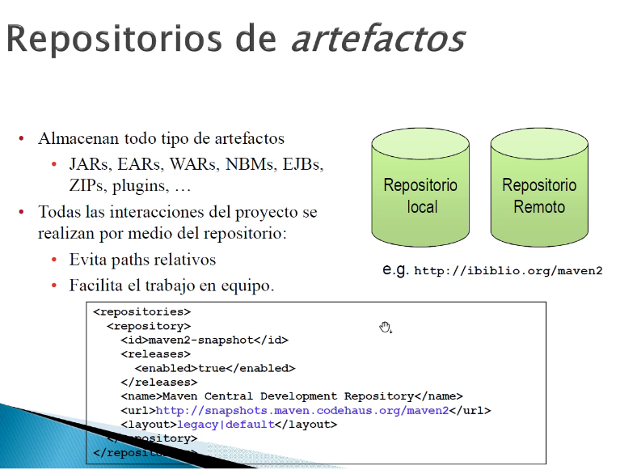

## Maven repository

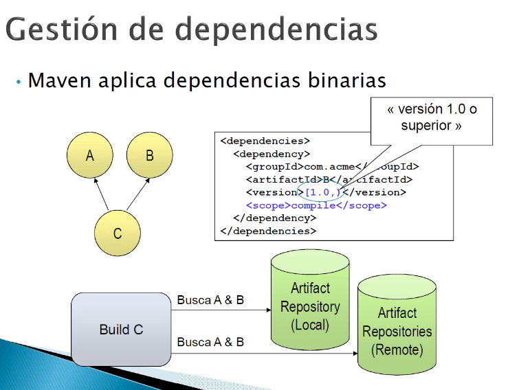

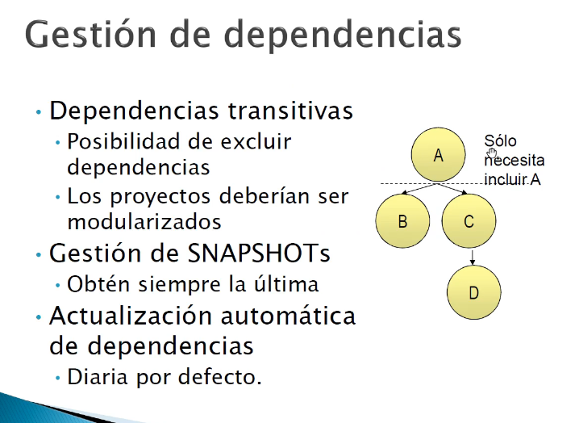

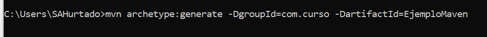

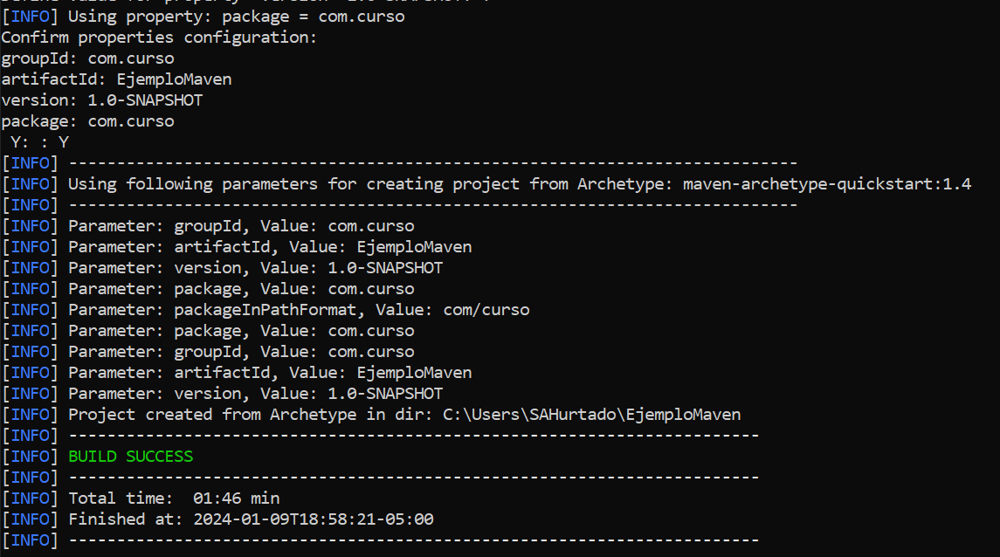

generar documentacion con plugin javadoc:javadoc

para mirar informacion del paquete se usa site:siste plugin

## Arbol de dependencias

mvn dependency:tree
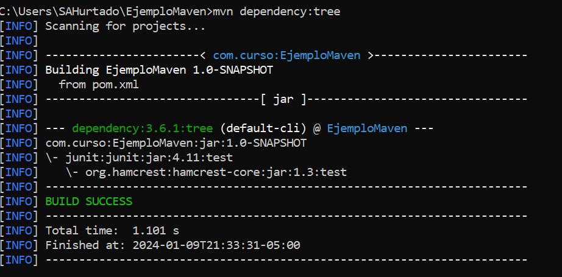

mvn dependency:resolve

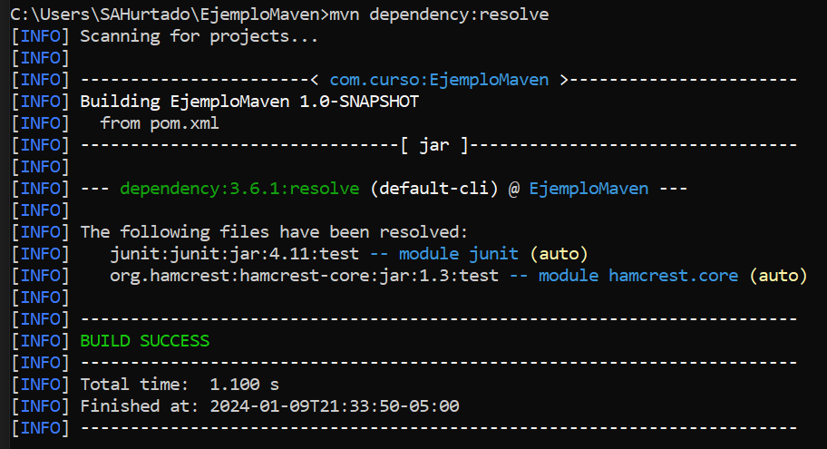

mvn dependency:analyze 

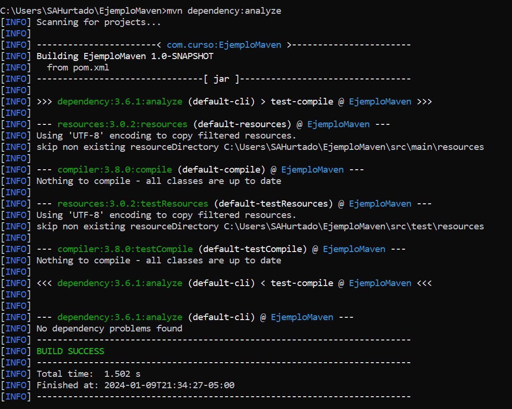

## Maven webapp

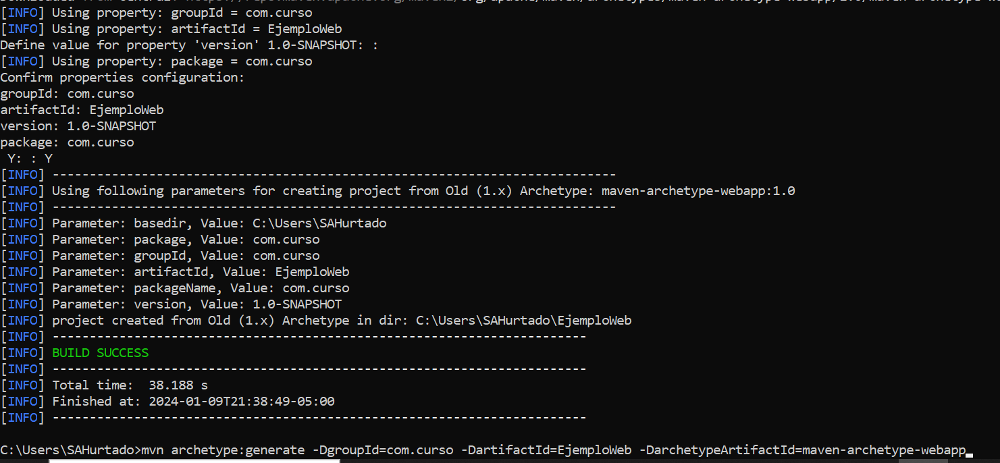

