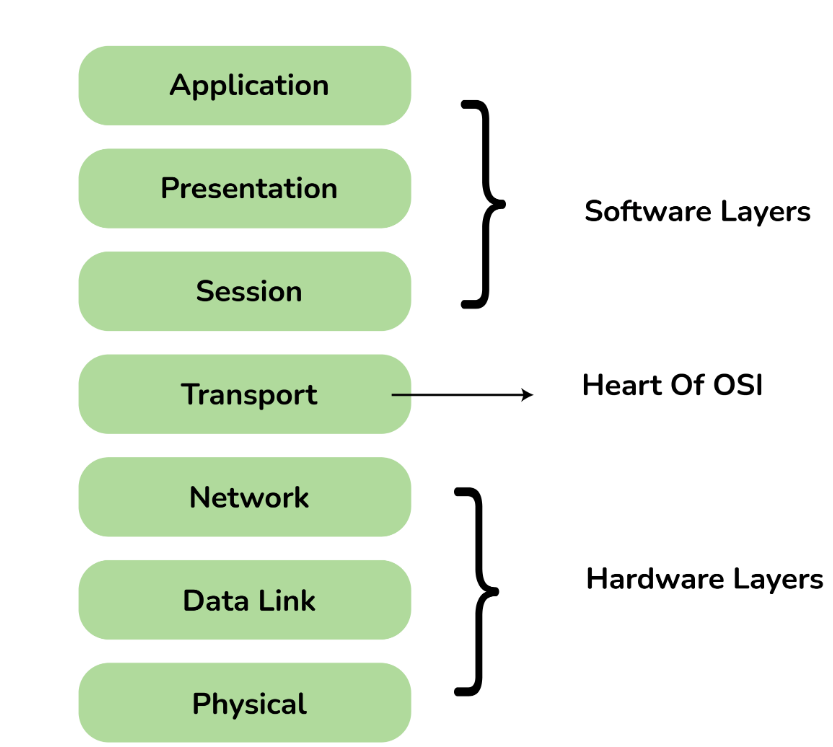
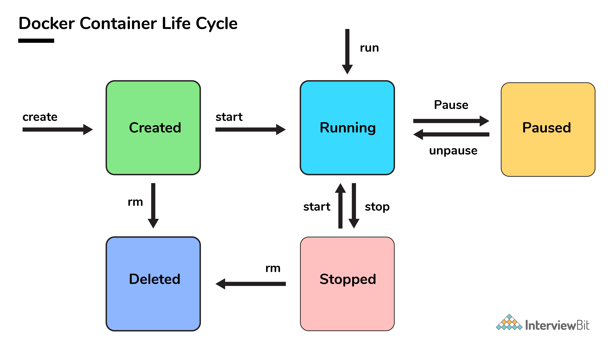

# Maven

- herramienta de compilacion
- herramienta para la gestion de dependencias en un proyecto
- herramienta de documentacion de proyectos

## Maven repository

generar documentacion con plugin javadoc:javadoc

para mirar informacion del paquete se usa site:siste plugin

## Arbol de dependencias

mvn dependency:tree

mvn dependency:resolve

mvn dependency:analyze 

## Maven webapp

