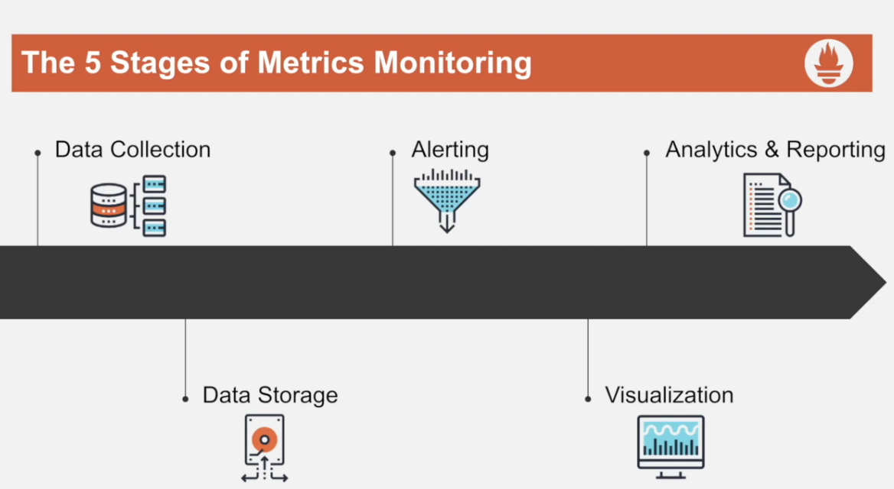
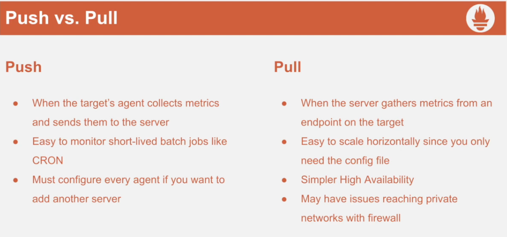

# Prometheus

Is an open source system monitoring and alerting toolkit with an active ecosystem

uses a multidimensional dat amodel with time series data identified by metric name and key/value pairs

EX: http_request_total {method="get"}

- uses a very simple query language "PromQL"
- no reliance on distributed storage; single server nodes are autonomous

## Architecture of prometheus server


The Prometheus ecosystem consists of multiple components, many of which are optional:

- the main Prometheus server which scrapes and stores time series data
- client libraries for instrumenting application code
- a push gateway for supporting short-lived jobs
- special-purpose exporters for services like HAProxy, StatsD, Graphite, etc.
- an alertmanager to handle alerts
- various support tools

Most Prometheus components are written in Go, making them easy to build and deploy as static binaries.





## Dimensional Data model
```
<aggregators> <functions> metric_name{key="value", ...}

```

## Overview of the prometheus service package

- **Console_libraries** prometheus expresion browser
- **Consoles** prometheus expresion browser
- **./tsdb** tool interact with time series
- **./promt** run queries from command line
- **prometheus.yml** configurations of prometheus
- **./prometheus**

```
./prometheus --storage.tsdb.retention.time=13d --config.file="./prometheus.yml" &
```

## Node exporter

La herramienta de node exporter en Prometheus también es conocida como Prometheus Node Exporter y una de sus características principales es que puede ser implementada en los procesos para obtener métricas de los nodos e información del sistema.

Además de esto, la opción de node exporter en Prometheus se encarga de ofrecer información útil para supervisar el rendimiento de un servidor o de un nodo.

```
kill -HUP %numero proceso prometheus para cargar nueva configuracion
```

## Prometheus as a Systemd Service

- Prometheus user
    ```
    sudo useradd -r -s /bin/false prometheus
    ```

- New directories
    - sudo mkdir /prom_data
    - sudo mkdir /etc/prometheus
    - sudo chown prometheus:prometheus /prom_data
- Extract and move files
    - cd prometheus*
    - mv console* , prometheus.yml /etc/prometheus
    - sudo chown -R prometheus:prometheus /etc/prometheus
- Move binaries
    - sudo mv prom* /usr/local/bin
    - sudo chown prometheus:prometheus /usr/local/bin/prom* 
- Create service file
    - sudo vim /etc/systemd/system/<service_name>.service

```
[Unit]
Description=Prometheus
Wants=network-online.target
After=neteork-online.target

[Service]
User=prometheus
Group=prometheus
Type=simple

ExecStart=/usr/local/bin/prometheus \
  --config.file /etc/prometheus/prometheus.yml \
  --storage.tsdb.path /prom_data \
  --web.console.templates=/etc/prometheus/consoles \
  --web.console.libraries=/etc/prometheus/console_libraries \
  --web.enable-lifecycle


[Install]
WantedBy=multi-user.target

```

## Node Exporter as a Systemd Service

- Nodeexporter user

  sudo useradd -r -s /bin/false nodeexporter
- move binaries
    - sudo mv node* /usr/local/bin
    - sudo chown nodeexporter:nodeexporter /usr/local/bin/node*
- create service file
    - sudo vim /etc/systemd/system/\<service_name>.service

```
[Unit]
Description=NodeExporter
Wants=network-online.target
After=network-online.target

[Service]
User=nodeexporter
Group=nodeexporter
Type=simple

ExecStart=/usr/local/bin/node_exporter

[Install]
WantedBy=multi-user.target
```

sudo systemctl daemon-reload
sudo systemctl start nodeexporter
sudo systemctl status nodeexporter

## Prometheus as a Docker Service

## Prometheus Metrics Format

- Summary
- Gauge
- Counter
- Histagram