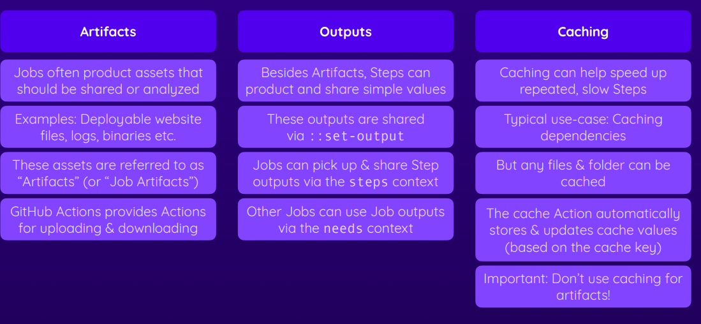

# GitHUB ACTION

A workflow automation service by GitHub

## Key components

- Workflows
- Jobs
- Steps


Thus far, you learned how to run simple shell commands like echo "Something" via run: echo "Something".

First Workflow

```
name: First Workflow
on: workflow_dispatch
jobs:
  first-job:
    runs-on: ubuntu-latest
    steps:
      - name: Print greeting
        run: echo "hello"
      - name: Print goodbye
        run: echo "bye"
```


If you need to run multiple shell commands (or multi-line commands, e.g., for readability), you can easily do so by adding the pipe symbol (|) as a value after the run: key.

Like this:

```
run: |
    echo "First output"
    echo "Second output"
```
This will run both commands in one step.

## Events that trigger workflows

You can configure your workflows to run when specific activity on GitHub happens, at a scheduled time, or when an event outside of GitHub occurs.


[events-that-trigger-workflows](https://docs.github.com/en/actions/using-workflows/events-that-trigger-workflows)


## Action


[https://github.com/marketplace?type=](https://github.com/marketplace?type=)


```
name: Test Project
on: push
jobs:
  test:
    runs-on: ubuntu-latest
    steps:
      - name: Get code
        uses: actions/checkout@v3
      - name: Intall NodeJS
        uses: actions/setup-node@v3
        with:
          node-version: 18
      - name: Install dependencies
        run: npm ci
      - name: run test
        run: npm test

```

you can use the word needs to execute in sequential jobs instead of parallel

```
name: Deploy Project
on: push
jobs:
  test:
    runs-on: ubuntu-latest
    steps:
      - name: Get code
        uses: actions/checkout@v3
      - name: Install NodeJS
        uses: actions/setup-node@v3
        with:
          node-version: 18
      - name: Install dependencies
        run: npm ci
      - name: Run tests
        run: npm test
  deploy:
    needs: test
    runs-on: ubuntu-latest
    steps:
      - name: Get code
        uses: actions/checkout@v3
      - name: Install NodeJS
        uses: actions/setup-node@v3
        with:
          node-version: 18
      - name: Install dependencies
        run: npm ci
      - name: Build project
        run: npm run build
      - name: Deploy
        run: echo "Deploying ..."

```

## Multiply triggers

```
name: Deploy Project
on: [push, workflow_dispatch]
jobs:
  test:
    runs-on: ubuntu-latest
    steps:
      - name: Get code
        uses: actions/checkout@v3
      - name: Install NodeJS
        uses: actions/setup-node@v3
        with:
          node-version: 18
      - name: Install dependencies
        run: npm ci
      - name: Run tests
        run: npm test
  deploy:
    needs: test
    runs-on: ubuntu-latest
    steps:
      - name: Get code
        uses: actions/checkout@v3
      - name: Install NodeJS
        uses: actions/setup-node@v3
        with:
          node-version: 18
      - name: Install dependencies
        run: npm ci
      - name: Build project
        run: npm run build
      - name: Deploy
        run: echo "Deploying ..."

```

### Expressions and Contexts objects

 https://docs.github.com/en/actions/learn-github-actions/contexts

 https://docs.github.com/en/actions/learn-github-actions/expressions

 ```
name: Output information
on: workflow_dispatch
jobs:
  info:
    runs-on: ubuntu-latest
    steps:
      - name: Output GitHub context
        run: echo "${{ toJSON(github) }}"
 ```


 ```
name: Deployment Exercise 1
on: push
jobs:
  deploy:
    runs-on: ubuntu-latest
    steps:
      - name: Get code
        uses: actions/checkout@v3
      - name: Install dependencies
        run: npm ci
      - name: Lint
        run: npm run lint
      - name: Test code
        run: npm run test
      - name: Build code
        run: npm run build
      - name: Deploy code
        run: echo "Deploying..."
 ```

 ```
name: Deployment Exercise 2
on: push
jobs:
  lint:
    runs-on: ubuntu-latest
    steps: 
      - name: Get code
        uses: actions/checkout@v3
      - name: Install dependencies
        run: npm ci
      - name: Lint
        run: npm run lint
  test:
    needs: lint
    runs-on: ubuntu-latest
    steps: 
      - name: Get code
        uses: actions/checkout@v3
      - name: Install dependencies
        run: npm ci
      - name: Test code
        run: npm run test
  deploy:
    needs: test
    runs-on: ubuntu-latest
    steps:
      - name: Get code
        uses: actions/checkout@v3
      - name: Install dependencies
        run: npm ci
      - name: Build code
        run: npm run build
      - name: Deploy code
        run: echo "Deploying..."
 ```

 ```
 name: Handel issues
on: issues
jobs:
  info:
    runs-on: ubuntu-latest
    steps:
      - name: Output event details
        run: echo "${{ toJSON(github.event) }}"
```

## Workflows and Events


https://docs.github.com/en/actions/using-workflows/workflow-syntax-for-github-actions#filter-pattern-cheat-sheet

```
name: Events Demo 1
on: 
  pull_request:
      types:
          - opened
  workflow_dispatch:

jobs:
  deploy:
    runs-on: ubuntu-latest
    steps:
      - name: Output event data
        run: echo "${{ toJSON(github.event) }}"
      - name: Get code
        uses: actions/checkout@v3
      - name: Install dependencies
        run: npm ci
      - name: Test code
        run: npm run test
      - name: Build code
        run: npm run build
      - name: Deploy project
        run: echo "Deploying..."
```

```
name: Events Demo 1
on: 
  pull_request:
      types:
          - opened
      branches: 
        - main # main
        - master # dev-new dev-this-is-new
        - 'feat/**' # feat/new feat/new/button
  workflow_dispatch:
  push:
    branches: 
      - main
      - master
      - 'feat/**'
    paths-ignore:
      - 'github/workflows/*'
jobs:
  deploy:
    runs-on: ubuntu-latest
    steps:
      - name: Output event data
        run: echo "${{ toJSON(github.event) }}"
      - name: Get code
        uses: actions/checkout@v3
      - name: Install dependencies
        run: npm ci
      - name: Test code
        run: npm run test
      - name: Build code
        run: npm run build
      - name: Deploy project
        run: echo "Deploying..."
```

## A note about fork pull request workflows

by default, pull requests based on Forks do NOT trigger a workflow because everyone can fork and open pull requests

First time contributors must be approved manually

## Cancelling and Skipping workflows Runs

Cancelling: by default, workflows get cancelled if jobs fail
by dafeult a job fails if at least one step fails
you can also cancel workflows manually

Skipping: by default all matching event start a workflow, execption for "push" and "pull_request"
skip with proper commit message

like
[skip ci]
[ci skip] 
[no ci]
[skip actions]
[actions skip]
```
git commit -m "added coments [skip ci]"

```

# Artifacts


```
name: Deploy website
on:
  push:
    branches:
      - main
jobs:
  test:
    runs-on: ubuntu-latest
    steps:
      - name: Get code
        uses: actions/checkout@v3
      - name: Cache dependencies
        uses: actions/cache@v3
        with:
          path: ~/.npm
          key: deps-node-modules-${{ hashFiles('**/package-lock.json') }}
      - name: Install dependencies
        run: npm ci
      - name: Lint code
        run: npm run lint
      - name: Test code
        run: npm run test
  build:
    needs: test
    runs-on: ubuntu-latest
    outputs:
      script-file: ${{ steps.publish.outputs.script-file }}
    steps:
      - name: Get code
        uses: actions/checkout@v3
      - name: Cache dependencies
        uses: actions/cache@v3
        with:
          path: ~/.npm
          key: deps-node-modules-${{ hashFiles('**/package-lock.json') }}
      - name: Install dependencies
        run: npm ci
      - name: Build website
        run: npm run build
      - name: Publish JS filename
        id: publish
        run: find dist/assets/*.js -type f -execdir echo 'script-file={}' >> $GITHUB_OUTPUT ';'
      - name: Upload artifacts
        uses: actions/upload-artifact@v3
        with:
          name: dist-files
          path: dist
          # path: |
          #   dist
          #   package.json
  deploy:
    needs: build
    runs-on: ubuntu-latest
    steps:
      - name: Get build artifacts
        uses: actions/download-artifact@v3
        with:
          name: dist-files
      - name: Output contents
        run: ls
      - name: Output filename
        run: echo "${{ needs.build.outputs.script-file }}"
      - name: Deploy
        run: echo "Deploying..."

```

## Jobs output


you cna passed values like, dates, hash, random values to other jobs

```
name: Deploy website
on:
  push:
    branches:
      - main
jobs:
  test:
    runs-on: ubuntu-latest
    steps:
      - name: Get code
        uses: actions/checkout@v3
      - name: Cache dependencies
        uses: actions/cache@v3
        with:
          path: ~/.npm
          key: deps-node-modules-${{ hashFiles('**/package-lock.json') }}
      - name: Install dependencies
        run: npm ci
      - name: Lint code
        run: npm run lint
      - name: Test code
        run: npm run test
  build:
    needs: test
    runs-on: ubuntu-latest
    outputs:
      script-file: ${{ steps.publish.outputs.script-file }}
    steps:
      - name: Get code
        uses: actions/checkout@v3
      - name: Install dependencies
        run: npm ci
      - name: Build website
        run: npm run build
      - name: Publish js filename
        id: publish
        run: find dist/assets/*.js -type f -execdir echo 'script-file=h{}' >> $GITHUB_OUTPUT ';'
      - name: Upload artifacts
        uses: actions/upload-artifact@v3
        with:
          name: dist-files
          path: dist
          # path: |
          #   dist
          #   package.json
  deploy:
    needs: build
    runs-on: ubuntu-latest
    steps:
      - name: Get build artifacts
        uses: actions/download-artifact@v3
        with:
          name: dist-files
      - name: Output contents
        run: ls
      - name: output filename
        run: echo "${{ needs.build.outputs.script-file }}"
      - name: Deploy
        run: echo "Deploying..."

```

## Caching Dependencies



## Using environments variables and secrets


**Detecting the operating system**
You can write a single workflow file that can be used for different operating systems by using the RUNNER_OS default environment variable and the corresponding context property ${{ runner.os }}. For example, the following workflow could be run successfully if you changed the operating system from macos-latest to windows-latest without having to alter the syntax of the environment variables, which differs depending on the shell being used by the runner.
($env:NAME for PowerShell on Windows, and $NAME for bash and sh on Linux and MacOS)

```
jobs:
  if-Windows-else:
    runs-on: macos-latest
    steps:
      - name: condition 1
        if: runner.os == 'Windows'
        run: echo "The operating system on the runner is $env:RUNNER_OS."
      - name: condition 2
        if: runner.os != 'Windows'
        run: echo "The operating system on the runner is not Windows, it's $RUNNER_OS."
```

GitHub Actions also provides a couple of default environment variables that are set automatically: https://docs.github.com/en/actions/learn-github-actions/environment-variables#default-environment-variables

These environment variable can, for example, give you quick access to the repository to which the workflow belongs, the name of the event that triggered the workflow and many other things.

**Secrets**
Secrets are encrypted variables that you create in an organization, repository, or repository environment. The secrets that you create are available to use in GitHub Actions workflows

For secrets stored at the organization-level, you can use access policies to control which repositories can use organization secrets. Organization-level secrets let you share secrets between multiple repositories, which reduces the need for creating duplicate secrets. Updating an organization secret in one location also ensures that the change takes effect in all repository workflows that use that secret.

For secrets stored at the environment level, you can enable required reviewers to control access to the secrets. A workflow job cannot access environment secrets until approval is granted by required approvers.

https://docs.github.com/en/actions/security-guides/encrypted-secrets


```
name: Deployment
on:
  push:
    branches:
      - main
      - dev
env:
  MONGODB_DB_NAME: gha-demo
jobs:
  test:
    environment: testing
    runs-on: ubuntu-latest
    env:
      MONGODB_CLUSTER_ADDRESS: cluster0.ntrwp.mongodb.net
      MONGODB_USERNAME: ${{ secrets.MONGODB_USERNAME }}
      MONGODB_PASSWORD: ${{ secrets.MONGODB_PASSWORD }}
      PORT: 8080
    steps:
      - name: Get Code
        uses: actions/checkout@v3
      - name: Cache dependencies
        uses: actions/cache@v3
        with:
          path: ~/.npm
          key: npm-deps-${{ hashFiles('**/package-lock.json') }}
      - name: Install dependencies
        run: npm ci
      - name: Run server
        run: npm start & npx wait-on http://127.0.0.1:$PORT # requires MongoDB Atlas to accept requests from anywhere!
      - name: Run tests
        run: npm test
      - name: Output information
        run: |
          echo "MONGODB_USERNAME: $MONGODB_USERNAME"
  deploy:
    needs: test
    runs-on: ubuntu-latest
    steps:
      - name: Output information
        env:
          PORT: 3000
        run: |        
          echo "MONGODB_DB_NAME: $MONGODB_DB_NAME"
          echo "MONGODB_USERNAME: $MONGODB_USERNAME"
          echo "${{ env.PORT }}"

```


## Controlling Execution Flow

### controlling execution via if

```
name: Website Deployment
on:
  push:
    branches:
      - main
jobs:
  lint:
    runs-on: ubuntu-latest
    steps:
      - name: Get code
        uses: actions/checkout@v3
      - name: Cache dependencies
        id: cache
        uses: actions/cache@v3
        with:
          path: node_modules
          key: deps-node-modules-${{ hashFiles('**/package-lock.json') }}
      - name: Install dependencies
        if: steps.cache.outputs.cache-hit != 'true'
        run: npm ci
      - name: Lint code
        run: npm run lint
  test:
    runs-on: ubuntu-latest
    steps:
      - name: Get code
        uses: actions/checkout@v3
      - name: Cache dependencies
        id: cache
        uses: actions/cache@v3
        with:
          path: node_modules
          key: deps-node-modules-${{ hashFiles('**/package-lock.json') }}
      - name: Install dependencies
        if: steps.cache.outputs.cache-hit != 'true'
        run: npm ci
      - name: Test code
        id: run-tests
        run: npm run test
      - name: Upload test report
        if: failure() && steps.run-tests.outcome == 'failure'
        uses: actions/upload-artifact@v3
        with:
          name: test-report
          path: test.json
  build:
    needs: test
    runs-on: ubuntu-latest
    steps:
      - name: Get code
        uses: actions/checkout@v3
      - name: Cache dependencies
        id: cache
        uses: actions/cache@v3
        with:
          path: node_modules
          key: deps-node-modules-${{ hashFiles('**/package-lock.json') }}
      - name: Install dependencies
        if: steps.cache.outputs.cache-hit != 'true'
        run: npm ci
      - name: Build website
        id: build-website
        run: npm run build
      - name: Upload artifacts
        uses: actions/upload-artifact@v3
        with:
          name: dist-files
          path: dist
  deploy:
    needs: build
    runs-on: ubuntu-latest
    steps:
      - name: Get build artifacts
        uses: actions/download-artifact@v3
        with:
          name: dist-files
      - name: Output contents
        run: ls
      - name: Deploy
        run: echo "Deploying..."
  report:
    needs: [lint, deploy]
    if: failure()
    runs-on: ubuntu-latest
    steps:
      - name: Output information
        run: | 
          echo "Something went wrong"
          echo "${{ toJSON(github) }}"
```