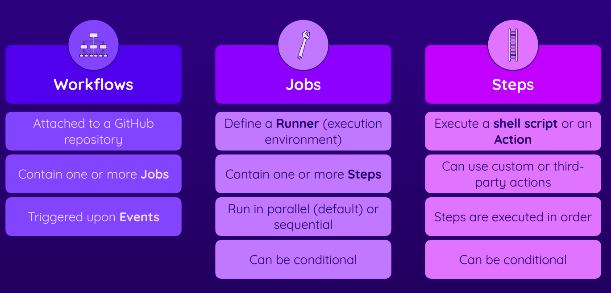
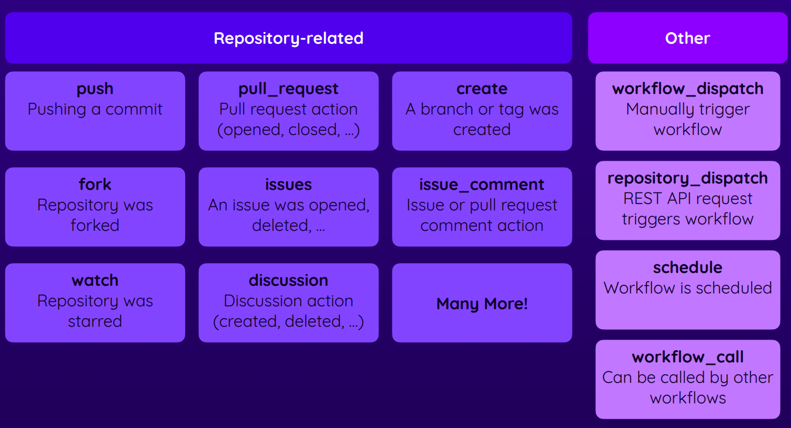
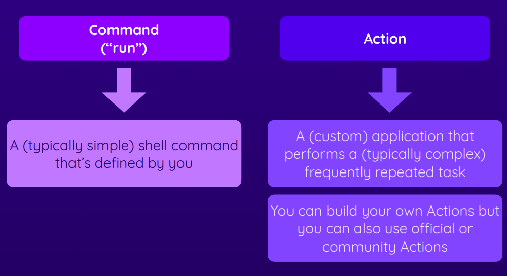
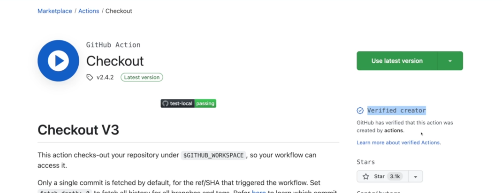
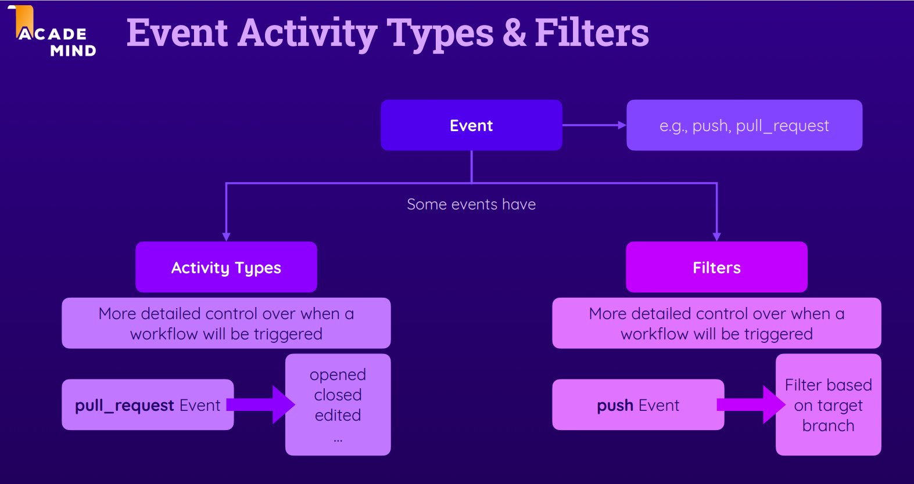

# GitHUB ACTION

A workflow automation service by GitHub

## Key components

- Workflows
- Jobs
- Steps




Thus far, you learned how to run simple shell commands like echo "Something" via run: echo "Something".

First Workflow

```
name: First Workflow
on: workflow_dispatch
jobs:
  first-job:
    runs-on: ubuntu-latest
    steps:
      - name: Print greeting
        run: echo "hello"
      - name: Print goodbye
        run: echo "bye"
```


If you need to run multiple shell commands (or multi-line commands, e.g., for readability), you can easily do so by adding the pipe symbol (|) as a value after the run: key.

Like this:

```
run: |
    echo "First output"
    echo "Second output"
```
This will run both commands in one step.

## Events that trigger workflows

You can configure your workflows to run when specific activity on GitHub happens, at a scheduled time, or when an event outside of GitHub occurs.


[events-that-trigger-workflows](https://docs.github.com/en/actions/using-workflows/events-that-trigger-workflows)



## Action





[https://github.com/marketplace?type=](https://github.com/marketplace?type=)


```
name: Test Project
on: push
jobs:
  test:
    runs-on: ubuntu-latest
    steps:
      - name: Get code
        uses: actions/checkout@v3
      - name: Intall NodeJS
        uses: actions/setup-node@v3
        with:
          node-version: 18
      - name: Install dependencies
        run: npm ci
      - name: run test
        run: npm test

```

you can use the word needs to execute in sequential jobs instead of parallel

```
name: Deploy Project
on: push
jobs:
  test:
    runs-on: ubuntu-latest
    steps:
      - name: Get code
        uses: actions/checkout@v3
      - name: Install NodeJS
        uses: actions/setup-node@v3
        with:
          node-version: 18
      - name: Install dependencies
        run: npm ci
      - name: Run tests
        run: npm test
  deploy:
    needs: test
    runs-on: ubuntu-latest
    steps:
      - name: Get code
        uses: actions/checkout@v3
      - name: Install NodeJS
        uses: actions/setup-node@v3
        with:
          node-version: 18
      - name: Install dependencies
        run: npm ci
      - name: Build project
        run: npm run build
      - name: Deploy
        run: echo "Deploying ..."

```

## Multiply triggers

```
name: Deploy Project
on: [push, workflow_dispatch]
jobs:
  test:
    runs-on: ubuntu-latest
    steps:
      - name: Get code
        uses: actions/checkout@v3
      - name: Install NodeJS
        uses: actions/setup-node@v3
        with:
          node-version: 18
      - name: Install dependencies
        run: npm ci
      - name: Run tests
        run: npm test
  deploy:
    needs: test
    runs-on: ubuntu-latest
    steps:
      - name: Get code
        uses: actions/checkout@v3
      - name: Install NodeJS
        uses: actions/setup-node@v3
        with:
          node-version: 18
      - name: Install dependencies
        run: npm ci
      - name: Build project
        run: npm run build
      - name: Deploy
        run: echo "Deploying ..."

```

### Expressions and Contexts objects

 https://docs.github.com/en/actions/learn-github-actions/contexts

 https://docs.github.com/en/actions/learn-github-actions/expressions

 ```
name: Output information
on: workflow_dispatch
jobs:
  info:
    runs-on: ubuntu-latest
    steps:
      - name: Output GitHub context
        run: echo "${{ toJSON(github) }}"
 ```


 ```
name: Deployment Exercise 1
on: push
jobs:
  deploy:
    runs-on: ubuntu-latest
    steps:
      - name: Get code
        uses: actions/checkout@v3
      - name: Install dependencies
        run: npm ci
      - name: Lint
        run: npm run lint
      - name: Test code
        run: npm run test
      - name: Build code
        run: npm run build
      - name: Deploy code
        run: echo "Deploying..."
 ```

 ```
name: Deployment Exercise 2
on: push
jobs:
  lint:
    runs-on: ubuntu-latest
    steps: 
      - name: Get code
        uses: actions/checkout@v3
      - name: Install dependencies
        run: npm ci
      - name: Lint
        run: npm run lint
  test:
    needs: lint
    runs-on: ubuntu-latest
    steps: 
      - name: Get code
        uses: actions/checkout@v3
      - name: Install dependencies
        run: npm ci
      - name: Test code
        run: npm run test
  deploy:
    needs: test
    runs-on: ubuntu-latest
    steps:
      - name: Get code
        uses: actions/checkout@v3
      - name: Install dependencies
        run: npm ci
      - name: Build code
        run: npm run build
      - name: Deploy code
        run: echo "Deploying..."
 ```

 ```
 name: Handel issues
on: issues
jobs:
  info:
    runs-on: ubuntu-latest
    steps:
      - name: Output event details
        run: echo "${{ toJSON(github.event) }}"
```

## Workflows and Events



https://docs.github.com/en/actions/using-workflows/workflow-syntax-for-github-actions#filter-pattern-cheat-sheet

```
name: Events Demo 1
on: 
  pull_request:
      types:
          - opened
  workflow_dispatch:

jobs:
  deploy:
    runs-on: ubuntu-latest
    steps:
      - name: Output event data
        run: echo "${{ toJSON(github.event) }}"
      - name: Get code
        uses: actions/checkout@v3
      - name: Install dependencies
        run: npm ci
      - name: Test code
        run: npm run test
      - name: Build code
        run: npm run build
      - name: Deploy project
        run: echo "Deploying..."
```

```
name: Events Demo 1
on: 
  pull_request:
      types:
          - opened
      branches: 
        - main
        - master
        - 'feat/**'
  workflow_dispatch:
  push:
    branches: 
      - main
      - master
      - 'feat/**'
    paths-ignore:
      - 'github/workflows/*'
jobs:
  deploy:
    runs-on: ubuntu-latest
    steps:
      - name: Output event data
        run: echo "${{ toJSON(github.event) }}"
      - name: Get code
        uses: actions/checkout@v3
      - name: Install dependencies
        run: npm ci
      - name: Test code
        run: npm run test
      - name: Build code
        run: npm run build
      - name: Deploy project
        run: echo "Deploying..."
```

