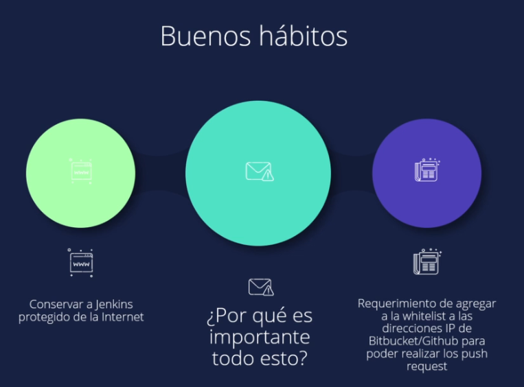
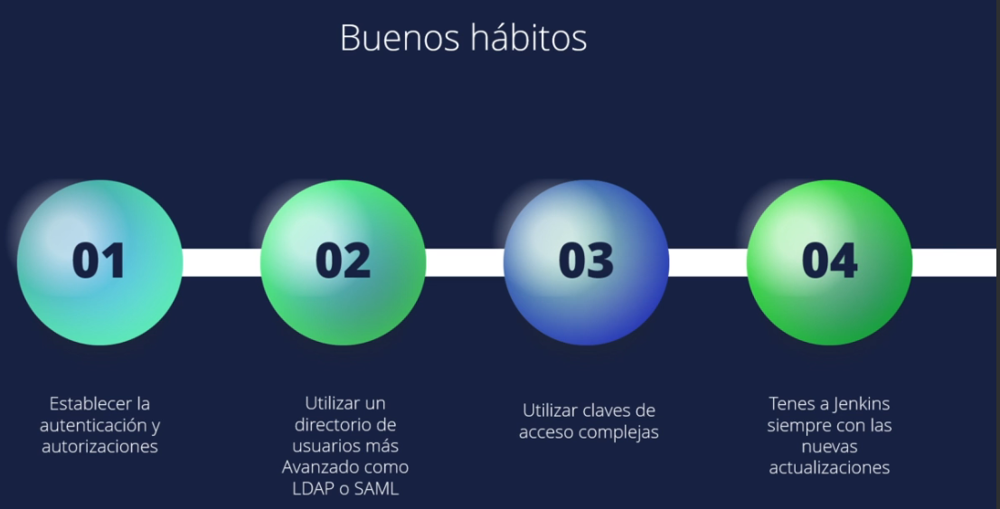
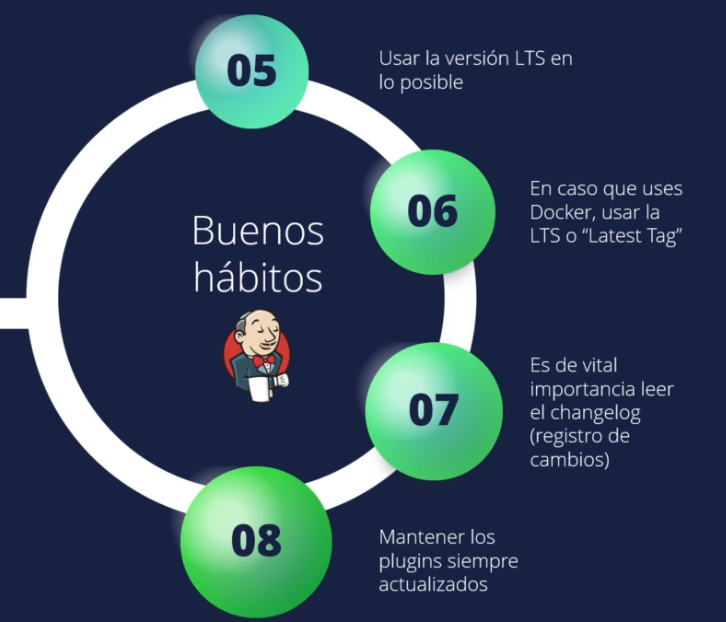
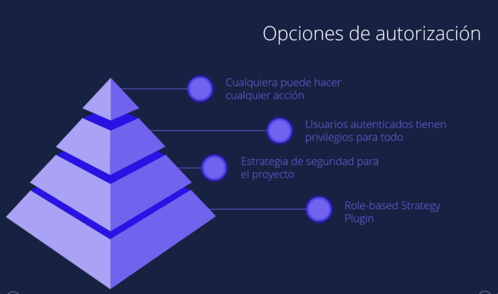
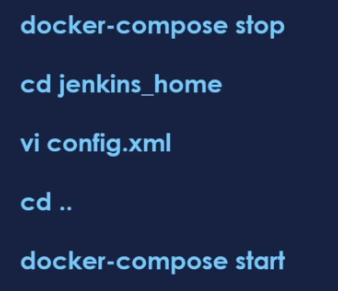
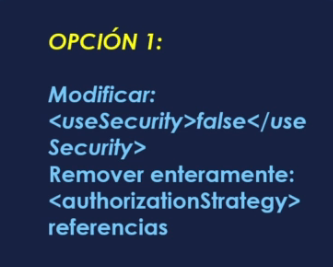
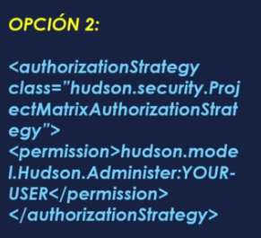
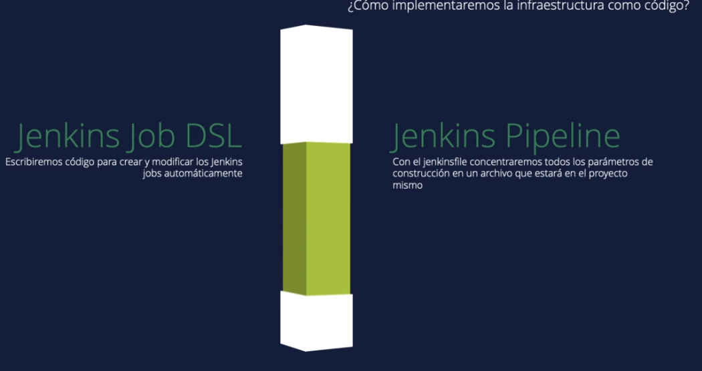

## Jenkins install

Long Term Support release
```
curl -fsSL https://pkg.jenkins.io/debian-stable/jenkins.io-2023.key | sudo tee \
  /usr/share/keyrings/jenkins-keyring.asc > /dev/null
echo deb [signed-by=/usr/share/keyrings/jenkins-keyring.asc] \
  https://pkg.jenkins.io/debian-stable binary/ | sudo tee \
  /etc/apt/sources.list.d/jenkins.list > /dev/null
sudo apt-get update
sudo apt-get install jenkins
´´´´

service jenkins start

```
Installation of Java

```
$ sudo apt update
$ sudo apt install openjdk-11-jre
$ java -version
openjdk version "11.0.12" 2021-07-20
OpenJDK Runtime Environment (build 11.0.12+7-post-Debian-2)
OpenJDK 64-Bit Server VM (build 11.0.12+7-post-Debian-2, mixed mode, sharing)
```

Unlocking Jenkins

The command: sudo cat /var/lib/jenkins/secrets/initialAdminPassword will print the password at console.

If you are running Jenkins in Docker using the official jenkins/jenkins image you can use sudo docker exec ${CONTAINER_ID or CONTAINER_NAME} cat /var/jenkins_home/secrets/initialAdminPassword to print the password in the console without having to exec into the container.

**USER DATA install jenkins EC2**

```
#!bin/bash
sudo apt update
sudo apt install openjdk-11-jdk -y

curl -fsSL https://pkg.jenkins.io/debian-stable/jenkins.io-2023.key | sudo tee \
  /usr/share/keyrings/jenkins-keyring.asc > /dev/null
echo deb [signed-by=/usr/share/keyrings/jenkins-keyring.asc] \
  https://pkg.jenkins.io/debian-stable binary/ | sudo tee \
  /etc/apt/sources.list.d/jenkins.list > /dev/null
  sudo apt-get update
  sudo apt-get install jenkins -y
```


# JENKINS #

Open source governance and community
Stability
Extensible
Visibility
Pipelines

JOB or BUILD


Pipeline

A Pipeline is a user-defined model of a CD pipeline. A Pipeline’s code defines your entire build process, which typically includes stages for building an application, testing it and then delivering it.

Also, a pipeline block is a key part of Declarative Pipeline syntax.
Node

A node is a machine which is part of the Jenkins environment and is capable of executing a Pipeline.

Also, a node block is a key part of Scripted Pipeline syntax.
Stage

A stage block defines a conceptually distinct subset of tasks performed through the entire Pipeline (e.g. "Build", "Test" and "Deploy" stages), which is used by many plugins to visualize or present Jenkins Pipeline status/progress. [6]
Step

A single task. Fundamentally, a step tells Jenkins what to do at a particular point in time (or "step" in the process). For example, to execute the shell command make use the sh step: sh 'make'. When a plugin extends the Pipeline DSL, [1] that typically means the plugin has implemented a new step.


Jenkinsfile (Declarative Pipeline)
```
pipeline {
    agent any 
    stages {
        stage('Build') { 
            steps {
                // 
            }
        }
        stage('Test') { 
            steps {
                // 
            }
        }
        stage('Deploy') { 
            steps {
                // 
            }
        }
    }
}


pipeline {
    agent any
    stages {
        stage ("Hello World"){
            steps {
                echo "Hello World"
            }
        }   
    }
}

``` 

## PIPELINE PARAMETRIZED

build with parameter
```
pipeline {
    agent any
    parameters {
        string(name: 'Greeting', defaultValue: 'Hello', description: 'How should I greet the world?')
    }
    stages {
        stage('Example') {
            steps {
                echo "${params.Greeting} World!"
            }
        }
    }
}
```
### MULTI_STEP  ###
```
pipeline {
    agent any
    stages {
        stage('Build') {
            steps {
                sh 'echo "Hello World"'
                sh '''  ### tres comillas multilinea
                    echo "Multiline shell steps works too"
                    ls -lah
                '''
            }
        }
    }
}

pipeline {
    agent any
    stages {
        stage('Build') {
            steps {
                sh 'echo "Hello World"'
            }
        }
        stage ('Build More'){
            steps {
                sh '''
                echo "Multiline shell steps works too"
                ls -lah
                '''
            }
        }
    }
}
```
## TIME OUT
```
pipeline {
    agent any
    stages {
        stage('Deploy') {
            steps {
                timeout(time: 1, unit: 'MINUTES') {
                    sh '/var/jenkins_home/scripts/fibonacci.sh 5'
                }
                timeout(time: 1, unit: 'MINUTES') {
                    sh '/var/jenkins_home/scripts/fibonacci.sh 32'
                }
            }
        }
    }
}
```
##  TRACKIN BUILD STATE

ingresar al build revisar console output or logs

## SCM POLL

Pipeline definition Pipeline script from SCM
SCM Git
URL
credentials if no public
branch

BUILD TRIGGER = POLLING SCM
y poner formato crontab

MIN HOUR DOM MON DOW CMD

Crontab Fields and Allowed Ranges (Linux Crontab Syntax)

|Field  |  Description |   Allowed Value|
|-|-|-|
|MIN     | Minute field |   0 to 59
|HOUR   |  Hour field    |  0 to 23
|DOM   |   Day of Month   | 1-31
|MON  |    Month field     |1-12
|DOW |     Day Of Week    | 0-6
|CMD|      Command        | Any command to be executed.

## WEBHOOK BUILD TRIGGEring

se debe agregar plan text del github con permisos en el repo y en el webhook

branch source bil configuration jenkinsfile


Cómo hacer Reset de la contraseña de Jenkins

En este procedimiento vamos a ver como resetear la clave del administrador de Jenkins, por si algunos se le ha olvidado, es un procedimiento bastante simple así que con solo seguir los pasos lo lograremos sin mayores dificultades.

1- Antes que nada vamos a tocar el archivo config.xml así que te recomiendo hacer una copia por las dudas que algo se rompa.

cp /var/lib/jenkins/config.xml /var/lib/jenkins/config.xml.back

2- Editamos el archivo

nano /var/lib/jenkins/config.xml

Y vamos a cambiar un valor, true por false

<useSecurity>false</useSecurity>

Guardamos y reiniciamos el servicio de jenkins

systemctl restart jenkins

3- Vamos a la interface web y colocamos la dirección nuevamente, en mi caso http://localhost:8080

    Vamos a"Manage Jenkins" > "Security" > "Configure Global Security" > "Security"
    Seleccionamos use Jenkins user database click en "Save"
    Ahora vamos a "People" > Click en el usuario admin por ejemplo, colocamos la nueva contraseña y clic en "Save"
na vez terminado podemos volvar a usar el archivo original /var/lib/jenkins/config.xml y reiniciar el servicio de Jenkins:

mv /var/lib/jenkins/config.xml.back /var/lib/jenkins/config.xml
systemctl restart jenkins

Volvemos a iniciar la aplicación para validar que todo este correcto.
__________________________

Q1: Explain the master-slave architecture in Jenkins

Jenkins master pulls the code from the remote GitHub repository every time there is a code commit
Every slave node has a label associate with it
Master distributes the workload to all the Jenkins slaves
We can run a specific pipeline on a particular node by defining a label in the pipeline code
Q2: What is Jenkinsfile?

Jenkinsfile contains the definition of a Jenkins pipeline and is checked into the source control repository. It is a text file.
Q3: Explain the two types of pipelines in Jenkins

Scripted Pipeline: It is based on Groovy script as their Domain Specific Language. One or more node blocks do the core work throughout the entire pipeline.
Executes the pipeline or any of its stages on any available agent
Defines the build stage
Performs steps related to the building stage
Declarative Pipeline: It provides a simple and friendly syntax to define a pipeline. Here, the pipeline block represents the work done throughout the pipeline.
Executes the pipeline or any of its stages on any available agent
Defines the build stage
Performs steps related to the build stage
Q4: What is build in Jenkins?

In Jenkins, a “build” refers to the process of compiling, testing, and packaging source code to create a deliverable software artifact.
Source Code Retrieval: Fetch the code from the git repository
Build Execution: Start executing the code
Testing: Start testing the code
Packaging: Start packaging the code and store it in the artifactory
Artifact Archiving: Archive the artifactes after sometime
Notification: Send notification in the slack channel or over mail
Q5: How you will check the generated artifact/logs/Zar file in Jenkins?

If the Jenkins job has generated any artifacts then it has an Artifacts section in that
Alternatively, you can ssh into the Jenkins server, and from JENKINS_HOME/workspace/<Your_Job_Name>/ path you can download the artifact
Q6: How Jenkins can fetch the github or GitLab’s repository?

In order for Jenkins to checkout the github or GitLab’s repository we need to install the Git plugin.
We need to create the access token in the github or Gitlab and for that token we need to provide the credentials in Jenkins so that using that token Jenkins can perform the action.
Q7: How to automate the access token rotation in the GitLab and apply the new token in Jenkins?

We can use the GitLab’s API and use the GET method to get the access token and we can implement a script in which we need to rotate the token and then we need to use the Jenkins API and perform the POST method to apply the new token over there.
Q8: What is Jenkins’s shared library?

A Jenkins Shared Library is a powerful feature of the Jenkins automation server that allows you to define reusable code and functionality that can be shared across multiple Jenkins pipelines and projects.
Q9: What is the significance of stages in Jenkins?

Stages allow you to organize your pipeline into logical sections. For example, you might have stages like “Build,” “Test,” “Deploy to Staging,” and “Deploy to Production.” Each stage represents a specific phase of your software delivery process.
Within a pipeline, stages can be defined to run in parallel. This is useful when you have tasks that can be executed simultaneously, thus speeding up the overall pipeline execution time.
Stages can also be used to implement conditional logic. Depending on the outcome of a previous stage, you can decide whether to proceed with the subsequent stages or terminate the pipeline.
By breaking down the pipeline into stages, it becomes easier to identify which stage failed if a failure occurs during pipeline execution. This helps in quickly diagnosing and fixing issues.
Stages can be configured to send notifications when they start or complete, making it easier to track the progress of the pipeline. Additionally, you can generate reports or artifacts at different stages to capture relevant information.
Q10: What are the general plugins in Jenkins?

Source Code Management (SCM) Plugins: These plugins enable Jenkins to integrate with version control systems like Git, Subversion, Mercurial, etc., allowing it to pull source code from repositories for building and testing.
Build Tool Plugins: Jenkins can be integrated with build tools such as Apache Maven, Gradle, Ant, and others.
Testing and Reporting Plugins: Jenkins offers plugins for various testing frameworks like JUnit, TestNG, NUnit, and more.
Deployment Plugins: Plugins for deploying applications to different environments, including application servers, cloud platforms, and container orchestration systems like Docker, Kubernetes, AWS, etc.
Notification Plugins: These plugins provide options for sending notifications and alerts via email, Slack, HipChat, or other messaging platforms to inform team members about build and deployment statuses.
Authentication and Authorization Plugins: Jenkins supports various authentication mechanisms, and plugins can be used to integrate with external authentication providers, like LDAP, Active Directory, OAuth, etc.
Monitoring and Visualization Plugins: Plugins that offer monitoring dashboards, visualizations, and reporting for build and deployment activities.
Artifacts and Dependency Management Plugins: Plugins for managing build artifacts, dependencies, and publishing artifacts to artifact repositories.
Integration Plugins: Plugins to integrate Jenkins with other tools, services, and platforms, such as GitHub, Bitbucket, JIRA, SonarQube, Artifactory, etc.
Q11: What are some of the default environmental variables in Jenkins?

$JOB_NAME — The name that you give your job when it is first set up.
$NODE_NAME — This is the name of the node on which the current build is running.
$WORKSPACE — Refers to the path of the workspace
$BUILD_URL — Indicates the URL where the results of the builds can be found.
$JENKINS_URL — This is set to the URL of the Jenkins master that is responsible for running the build.
Q12: How do you store credentials in Jenkins securely?

Credentials can be stored securely in Jenkins using the Credentials plugin, which stores different types of credentials like — Username with a password, SSH username with the private key, AWS Credentials, Jenkins Build Token, Secret File/Text, X509 & other certificates, Vault related credentials securely with proper encryption & decryption as and when required.
Q13: How does Jenkins know when to execute a Scheduled job/pipeline and how it is triggered?

The Jenkins master will have the cron entries set up for the jobs as per the scheduled job configurations. As and when the time for a particular job comes, it commands agents (based on the configuration of the job) to execute the job with the required configurations.
Q14: What are executors and how many executors do we get by default?

Executors define how many jobs we can run in parallel. By default we get 2 executors but we can also increase that number
Q15: From one server to another, how do you copy or move your Jenkins jobs?

First, we need to copy our jobs directory from the old to the new server. There are multiple ways to do it. We can either move the job from the installation by simply copying the corresponding job directory or we can make a clone of the job directory by making an existing job’s copy. For this, we need to have a different name, which we can rename later.
________________

|| Questions ||
What’s the difference between continuous integration, continuous delivery, and continuous deployment?
Continuous IntegrationContinuous DeliveryContinuous DeploymentThe practice of merging development work with the main branch continuously.Continuous delivery of code to an environment once the code is ready to ship. This could be staging or production. The idea is the product is delivered to a user base, which can be QAs or customers for review and inspection.The deployment or release of code to production as soon as it is ready.

2. Benefits of CI/CD

CI/CD (Continuous Integration/Continuous Deployment) streamlines development and delivery processes, offering benefits like faster releases, reduced manual errors, increased collaboration and improved quality through automated testing.

3.What is meant by CI-CD?

CI/CD stands for Continuous Integration and Continuous Deployment. It’s a set of practices that automate software build, testing, and deployment processes, ensuring frequent and reliable releases.

4. What is Jenkins Pipeline?
Jenkins Pipeline is a suite of plugins that allows defining and automating a CI/CD process in code. It enables building, testing, and deploying applications using declarative or scripted pipelines.

5.How do you configure the job in Jenkins?

In Jenkins, you configure a job by specifying the project details, source code repository, build steps, triggers, post-build actions, and other settings through the Jenkins web interface.

6. Where do you find errors in Jenkins?

Errors in Jenkins can be found in the console output of the build jobs. Navigate to the build job’s page and check the console output for error messages.

7. In Jenkins how can you find log files?

Jenkins build logs can be found in the build job’s workspace. Navigate to the specific build, and you’ll find a “Console Output” link. Additional logs might be available based on your job’s configuration.

8. Jenkins workflow and write a script for this workflow?

Jenkins workflow refers to the sequence of stages, steps, and actions that automate the software delivery process. Writing a Jenkins pipeline script involves defining stages, steps, and using Jenkinsfile to automate the workflow.

9. How to create a continuous deployment in Jenkins?

Continuous deployment in Jenkins involves creating a pipeline that automates the entire deployment process. Define stages for building, testing, and deploying the application. Trigger the pipeline on code changes or other events.

10. How to build a job in Jenkins?

To build a job in Jenkins, define the job’s configuration, including source code repository, build steps, triggers, and post-build actions. Jenkins will automatically build the job based on the configuration.

11. Why do we use a pipeline in Jenkins?

Pipelines in Jenkins provide a structured and automated way to define, visualize, and manage the entire CI/CD process. It allows versioning, code review, and easy replication of complex workflows.

12.Is Only Jenkins enough for automation?

Jenkins is a powerful automation tool, but depending on your needs, you might use it in conjunction with other tools like version control systems, testing frameworks, containerization, and orchestration tools for a complete automation solution.

13.How will you handle secrets?

Secrets should be managed securely. Jenkins provides plugins like “Credentials Plugin” to store and manage secrets, passwords, and API keys. Use these plugins to ensure sensitive data is properly encrypted.

14. Explain diff stages in CI-CD setup.

CI/CD stages typically include building, testing, packaging, deploying, and monitoring. Each stage represents a specific step in the software delivery pipeline.

15. Name some of the plugins in Jenkins.

Some popular Jenkins plugins include:
- Git Plugin
- Docker Pipeline
- Slack Notification
- JUnit Plugin
- SonarQube Scanner
- Blue Ocean (for enhanced pipeline visualization).

_______________________


_______________________________

# La guia de Jenkins de cero a experto 

Jenkins es una herramienta CI/CD de fuente abierta escrita en java

es una aplicacion basada en servidor y requiere un servicdor web como apache tomcat


## Arquitectura jenkins

**jenkins job:** tareas ejecutables qeu son supervisadas y controladas por jenkins

### Master and Slave


jenkins executor


un nodo puede tener uno o más ejecutores

https://automatenow.io/jenkins-master-slave-architecture/#:~:text=Jenkins%20Master%2DSlave%20architecture%20allows,and%20accelerating%20the%20build%20process.

https://medium.com/edureka/jenkins-interview-questions-7bb54bc8c679

**Throttle Build** es una característica útil en Jenkins que te permite gestionar de manera eficiente la ejecución de construcciones, evitando la sobrecarga del servidor y optimizando el uso de recursos compartidos.

La función Throttle Build se basa en la configuración de "períodos de espera" (wait periods) y "capacidades" (capacities) para cada tipo de build o proyecto. Veamos cómo funciona con un ejemplo:

Supongamos que tienes dos proyectos en Jenkins que comparten recursos y quieres limitar la cantidad de construcciones simultáneas que pueden ejecutarse en ellos.

Ejemplo:
Proyecto A:
Debe permitirse solo una construcción simultánea.
Si una construcción está en curso, la siguiente debe esperar.
Proyecto B:
Puede tener hasta tres construcciones simultáneas.
Si las tres construcciones están en curso, las siguientes deben esperar.
Para lograr esto, configurarías Throttle Build de la siguiente manera:

Configuración de Throttle Build para Proyecto A:

Capacity: 1
Throttle Category: Proyecto_A
Configuración de Throttle Build para Proyecto B:

Capacity: 3
Throttle Category: Proyecto_B
Ahora, cuando se inicia una construcción en cualquiera de los proyectos:

Si Proyecto A está en construcción y alguien intenta iniciar otra construcción, la segunda construcción se quedará en espera hasta que la construcción en Proyecto A se complete.
Si Proyecto B ya tiene tres construcciones en curso y alguien intenta iniciar una cuarta construcción, la cuarta construcción se quedará en espera hasta que al menos una de las construcciones en Proyecto B se complete y se libere una ranura de construcción.


## Seguridad Jenkins










para cambair autorizacion


remover estrategias de autorizacion para abrir todo a todos


la recomendable


## Automatizando con jenkins



### Jenkins job DSL

Jenkins DSL e suna manera de programar con codigo el job

el plugin jenkin job DSL es utilizado para definir uy construir jobs en una forma programable on los archivos de codigo

los usuarios pueden describir su job utilizando groovy base script lo que simplifica la manera d emanejar los jobs

#### Seed Job and description

para utilizar el plugin DSL, primerop se debe crear un seed job

**Seed Job** es un job de jenkins que ejecuta un codigo DSL y por medio de ese código se genera un nuevo job con los requerimientos establecidos

En Jenkins, un "job seed" se refiere a un tipo especial de trabajo (o job) que se utiliza para crear y configurar dinámicamente otros trabajos en Jenkins. En lugar de tener que crear manualmente cada trabajo y configurar sus características, un job seed automatiza este proceso al definir un conjunto de reglas y plantillas para la creación de trabajos.

Aquí te explico cómo se usa un job seed y te doy un ejemplo básico:

Uso de un Job Seed en Jenkins:
Definir el Job Seed: En Jenkins, creas un nuevo job y lo configuras como un job seed. Este job seed contendrá el código o la lógica que se utilizará para crear otros trabajos.

Escribir el código de configuración: En el job seed, puedes utilizar scripts, configuración en DSL (Domain Specific Language), o cualquier otro método compatible con Jenkins para definir cómo se deben crear y configurar los trabajos secundarios. Puedes incluir lógica condicional, bucles y cualquier otra funcionalidad que necesites para personalizar la creación de trabajos.

Ejecutar el Job Seed: Después de definir el job seed y su lógica de configuración, lo ejecutas. Durante la ejecución, el job seed creará dinámicamente los trabajos secundarios según las reglas que hayas definido.

Actualización y mantenimiento: Puedes actualizar y mantener el job seed según sea necesario. Si cambian los requisitos para la creación de trabajos, puedes modificar el job seed en lugar de actualizar manualmente cada trabajo individualmente.

https://jenkinsci.github.io/job-dsl-plugin/#


