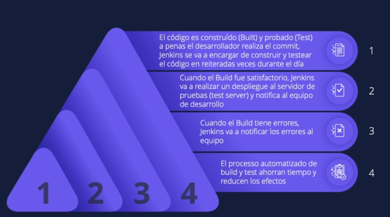
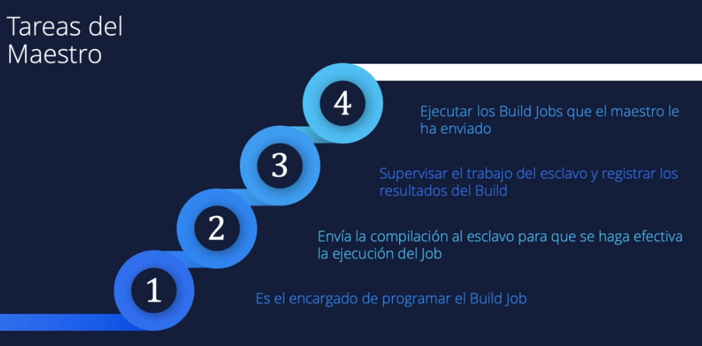
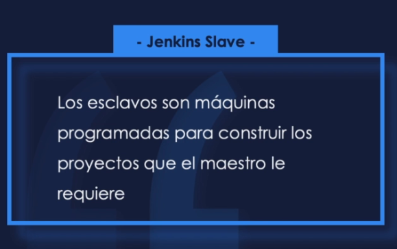
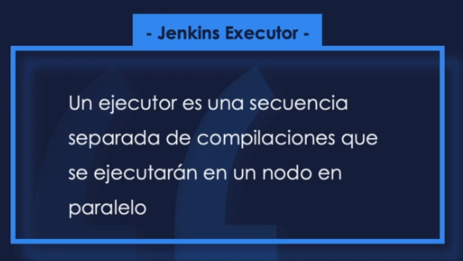

## Jenkins install

Long Term Support release
```
curl -fsSL https://pkg.jenkins.io/debian-stable/jenkins.io-2023.key | sudo tee \
  /usr/share/keyrings/jenkins-keyring.asc > /dev/null
echo deb [signed-by=/usr/share/keyrings/jenkins-keyring.asc] \
  https://pkg.jenkins.io/debian-stable binary/ | sudo tee \
  /etc/apt/sources.list.d/jenkins.list > /dev/null
sudo apt-get update
sudo apt-get install jenkins
´´´´

service jenkins start

```
Installation of Java

```
$ sudo apt update
$ sudo apt install openjdk-11-jre
$ java -version
openjdk version "11.0.12" 2021-07-20
OpenJDK Runtime Environment (build 11.0.12+7-post-Debian-2)
OpenJDK 64-Bit Server VM (build 11.0.12+7-post-Debian-2, mixed mode, sharing)
```

Unlocking Jenkins

The command: sudo cat /var/lib/jenkins/secrets/initialAdminPassword will print the password at console.

If you are running Jenkins in Docker using the official jenkins/jenkins image you can use sudo docker exec ${CONTAINER_ID or CONTAINER_NAME} cat /var/jenkins_home/secrets/initialAdminPassword to print the password in the console without having to exec into the container.

**USER DATA install jenkins EC2**

```
#!bin/bash
sudo apt update
sudo apt install openjdk-11-jdk -y

curl -fsSL https://pkg.jenkins.io/debian-stable/jenkins.io-2023.key | sudo tee \
  /usr/share/keyrings/jenkins-keyring.asc > /dev/null
echo deb [signed-by=/usr/share/keyrings/jenkins-keyring.asc] \
  https://pkg.jenkins.io/debian-stable binary/ | sudo tee \
  /etc/apt/sources.list.d/jenkins.list > /dev/null
  sudo apt-get update
  sudo apt-get install jenkins -y
```


# JENKINS #

Open source governance and community
Stability
Extensible
Visibility
Pipelines

JOB or BUILD


Pipeline

A Pipeline is a user-defined model of a CD pipeline. A Pipeline’s code defines your entire build process, which typically includes stages for building an application, testing it and then delivering it.

Also, a pipeline block is a key part of Declarative Pipeline syntax.
Node

A node is a machine which is part of the Jenkins environment and is capable of executing a Pipeline.

Also, a node block is a key part of Scripted Pipeline syntax.
Stage

A stage block defines a conceptually distinct subset of tasks performed through the entire Pipeline (e.g. "Build", "Test" and "Deploy" stages), which is used by many plugins to visualize or present Jenkins Pipeline status/progress. [6]
Step

A single task. Fundamentally, a step tells Jenkins what to do at a particular point in time (or "step" in the process). For example, to execute the shell command make use the sh step: sh 'make'. When a plugin extends the Pipeline DSL, [1] that typically means the plugin has implemented a new step.


Jenkinsfile (Declarative Pipeline)
```
pipeline {
    agent any 
    stages {
        stage('Build') { 
            steps {
                // 
            }
        }
        stage('Test') { 
            steps {
                // 
            }
        }
        stage('Deploy') { 
            steps {
                // 
            }
        }
    }
}


pipeline {
    agent any
    stages {
        stage ("Hello World"){
            steps {
                echo "Hello World"
            }
        }   
    }
}

``` 

## PIPELINE PARAMETRIZED

build with parameter
```
pipeline {
    agent any
    parameters {
        string(name: 'Greeting', defaultValue: 'Hello', description: 'How should I greet the world?')
    }
    stages {
        stage('Example') {
            steps {
                echo "${params.Greeting} World!"
            }
        }
    }
}
```
### MULTI_STEP  ###
```
pipeline {
    agent any
    stages {
        stage('Build') {
            steps {
                sh 'echo "Hello World"'
                sh '''  ### tres comillas multilinea
                    echo "Multiline shell steps works too"
                    ls -lah
                '''
            }
        }
    }
}

pipeline {
    agent any
    stages {
        stage('Build') {
            steps {
                sh 'echo "Hello World"'
            }
        }
        stage ('Build More'){
            steps {
                sh '''
                echo "Multiline shell steps works too"
                ls -lah
                '''
            }
        }
    }
}
```
## TIME OUT
```
pipeline {
    agent any
    stages {
        stage('Deploy') {
            steps {
                timeout(time: 1, unit: 'MINUTES') {
                    sh '/var/jenkins_home/scripts/fibonacci.sh 5'
                }
                timeout(time: 1, unit: 'MINUTES') {
                    sh '/var/jenkins_home/scripts/fibonacci.sh 32'
                }
            }
        }
    }
}
```
##  TRACKIN BUILD STATE

ingresar al build revisar console output or logs

## SCM POLL

Pipeline definition Pipeline script from SCM
SCM Git
URL
credentials if no public
branch

BUILD TRIGGER = POLLING SCM
y poner formato crontab

MIN HOUR DOM MON DOW CMD

Crontab Fields and Allowed Ranges (Linux Crontab Syntax)

|Field  |  Description |   Allowed Value|
|-|-|-|
|MIN     | Minute field |   0 to 59
|HOUR   |  Hour field    |  0 to 23
|DOM   |   Day of Month   | 1-31
|MON  |    Month field     |1-12
|DOW |     Day Of Week    | 0-6
|CMD|      Command        | Any command to be executed.

## WEBHOOK BUILD TRIGGEring

se debe agregar plan text del github con permisos en el repo y en el webhook

branch source bil configuration jenkinsfile


Cómo hacer Reset de la contraseña de Jenkins

En este procedimiento vamos a ver como resetear la clave del administrador de Jenkins, por si algunos se le ha olvidado, es un procedimiento bastante simple así que con solo seguir los pasos lo lograremos sin mayores dificultades.

1- Antes que nada vamos a tocar el archivo config.xml así que te recomiendo hacer una copia por las dudas que algo se rompa.

cp /var/lib/jenkins/config.xml /var/lib/jenkins/config.xml.back

2- Editamos el archivo

nano /var/lib/jenkins/config.xml

Y vamos a cambiar un valor, true por false

<useSecurity>false</useSecurity>

Guardamos y reiniciamos el servicio de jenkins

systemctl restart jenkins

3- Vamos a la interface web y colocamos la dirección nuevamente, en mi caso http://localhost:8080

    Vamos a"Manage Jenkins" > "Security" > "Configure Global Security" > "Security"
    Seleccionamos use Jenkins user database click en "Save"
    Ahora vamos a "People" > Click en el usuario admin por ejemplo, colocamos la nueva contraseña y clic en "Save"
na vez terminado podemos volvar a usar el archivo original /var/lib/jenkins/config.xml y reiniciar el servicio de Jenkins:

mv /var/lib/jenkins/config.xml.back /var/lib/jenkins/config.xml
systemctl restart jenkins

Volvemos a iniciar la aplicación para validar que todo este correcto.

_______________________________

# La guia de Jenkins de cero a experto 

Jenkins es una herramienta CI/CD de fuente abierta escrita en java

es una aplicacion basada en servidor y requiere un servicdor web como apache tomcat



## Arquitectura jenkins

**jenkins job:** tareas ejecutables qeu son supervisadas y controladas por jenkins

### Master and Slave






jenkins executor



un nodo puede tener uno o más ejecutores

https://automatenow.io/jenkins-master-slave-architecture/#:~:text=Jenkins%20Master%2DSlave%20architecture%20allows,and%20accelerating%20the%20build%20process.

https://medium.com/edureka/jenkins-interview-questions-7bb54bc8c679
